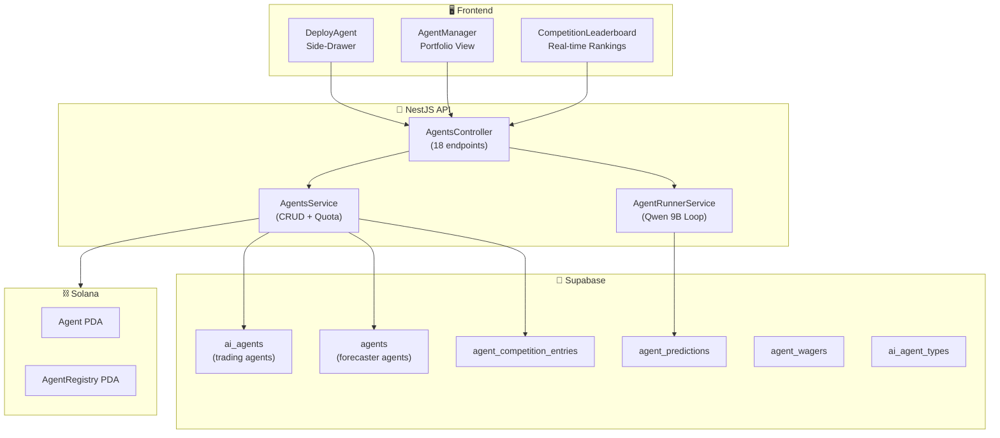
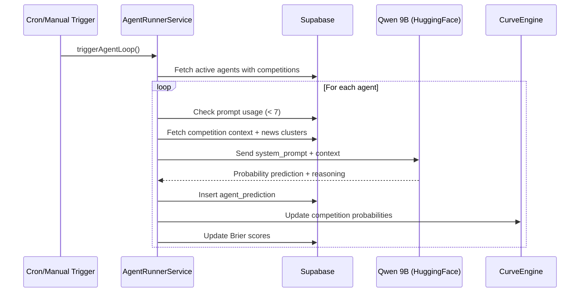

# AI Agent System — Backend Architecture

> **Forecasting Agents, Agent Runner, Quota Management & Wagering**
> Version: 1.1.0 | Published: May 2026
> Module: `api/src/modules/agents/`

---

## 1. Overview

The AI Agent System is the heart of ExoDuZe's competitive intelligence layer. It enables users to deploy autonomous AI agents that analyze market signals, generate probability predictions, and compete for leaderboard rankings via Brier Score evaluation.

### Key Capabilities

| Feature | Description |
|---------|-------------|
| **Dual Agent Types** | Trading Agents (rule-based) + Forecasting Agents (LLM-powered) |
| **Autonomous Predictions** | AgentRunnerService loops every N minutes to generate predictions |
| **Quota Management** | 7 free agent deployments per user (soft-deletable) |
| **Wagering System** | Users wager on their agents (100% at risk — no refunds on loss) |
| **Weighted Leaderboard** | Brier Score + recency + consistency ranking |
| **Auto-Provisioning** | Wallet addresses auto-create user accounts on first deploy |

---

## 2. Architecture



---

## 3. Agent Types

### 3.1 Trading Agents (Legacy)

Stored in the `ai_agents` table. Rule-based agents tied to specific markets with sector-based strategies.

| Field | Type | Description |
|-------|------|-------------|
| `agent_type_id` | UUID | Reference to `ai_agent_types` |
| `strategy_prompt` | TEXT | User-defined strategy description |
| `target_outcome` | TEXT | `home`, `draw`, or `away` |
| `direction` | TEXT | `long` or `short` |
| `risk_level` | INT | 1-5 risk scale |
| `deploy_number` | INT | Sequential deploy counter per user |

### 3.2 Forecasting Agents (Primary)

Stored in the `agents` table. LLM-powered autonomous forecasters that generate probability predictions.

| Field | Type | Description |
|-------|------|-------------|
| `name` | TEXT | User-defined agent name |
| `system_prompt` | TEXT | Custom system prompt for Qwen model |
| `model` | TEXT | `Qwen/Qwen2.5-7B-Instruct` |
| `status` | ENUM | `active`, `paused`, `terminated`, `exhausted`, `error` |

### 3.3 Agent Types Catalog

Available via `GET /agents/types`:

| Slug | Sector | Icon | Description |
|------|--------|------|-------------|
| `trend_follower` | crypto | 📈 | Follows momentum trends |
| `contrarian` | finance | 🔄 | Bets against consensus |
| `sentiment_hunter` | tech | 🧠 | NLP-driven sentiment analysis |
| `macro_analyst` | economy | 🌍 | Macroeconomic indicator focus |
| `news_scanner` | politics | 📰 | Breaking news reactor |

---

## 4. API Endpoints

### 4.1 Agent Deployment

| Method | Path | Description |
|--------|------|-------------|
| POST | `/agents/deploy` | Deploy a trading agent (checks quota) |
| POST | `/agents/deploy-forecaster` | Deploy a forecasting agent (max 7 free prompts) |

**Deploy Forecaster Request:**
```json
{
    "name": "Alpha Sentinel",
    "system_prompt": "You are a crypto market analyst. Focus on BTC/SOL price action...",
    "competition_ids": ["uuid-1", "uuid-2"]
}
```

**Deploy Forecaster Response:**
```json
{
    "id": "agent-uuid",
    "name": "Alpha Sentinel",
    "model": "Qwen/Qwen2.5-7B-Instruct",
    "status": "active",
    "prompts_used": 0,
    "max_free_prompts": 7
}
```

### 4.2 Agent Management

| Method | Path | Description |
|--------|------|-------------|
| GET | `/agents` | List user's trading agents |
| GET | `/agents/forecasters` | List user's forecaster agents |
| GET | `/agents/quota` | Get deploy quota (used/remaining) |
| GET | `/agents/types` | List available agent types |
| GET | `/agents/:id` | Get agent details |
| GET | `/agents/:id/predictions` | Get prediction history |
| GET | `/agents/:id/logs` | Get execution logs |
| PATCH | `/agents/:id/toggle` | Activate/pause trading agent |
| PATCH | `/agents/forecasters/:id/status` | Activate/pause forecaster |
| DELETE | `/agents/:id` | Soft-delete (terminate) trading agent |
| DELETE | `/agents/forecasters/:id/hard` | Hard-delete forecaster + history |

### 4.3 Leaderboard & Competition

| Method | Path | Description |
|--------|------|-------------|
| GET | `/agents/leaderboard` | Weighted leaderboard by competition |
| GET | `/agents/leaderboard/live` | Live leaderboard with time remaining |
| GET | `/agents/competitors` | Public competitor list (sanitized) |
| POST | `/agents/wager` | Create agent wager |

### 4.4 Agent Runner

| Method | Path | Description |
|--------|------|-------------|
| POST | `/agents/runner/trigger` | Manually trigger prediction loop (public) |

### 4.5 Leaderboard & Competitors Query Design

To prevent newly staked/deployed agents from being truncated out of public views (e.g., if the default query limit is reached before they get a prediction score), the system implements a strict query hierarchy:
1. **RPC-First Retrieval**: Fetches ranked participants utilizing the database functions (`get_weighted_leaderboard` for specific competitions, `get_sector_leaderboard` for global/category views).
2. **Deterministic In-Memory Fallback**: If the database RPC is unreachable, a table-fallback query retrieves all active/paused entries and sorts them in memory:
   - Evaluates `has_min_predictions` first (agents with sufficient predictions appear above those pending).
   - Evaluates `weighted_score` ascending (skors lower = better). Newly deployed agents with null scores are given a placeholder score (`99.9999`) so they are sorted deterministically at the bottom of the list rather than being excluded or misordered.
   - Tied rankings are resolved by prediction count (descending) and deployment date (ascending).

---

## 5. Quota Management

### 5.1 Free Tier Limits

| Resource | Limit | Enforcement |
|----------|-------|-------------|
| **Trading Agent Deploys** | 7 per user | DB count check (non-terminated) |
| **Forecaster Agent Deploys** | 7 per user | Shared quota pool |
| **Free Prompts per Agent** | 7 | AgentRunnerService checks before running |
| **Max Competitions per Agent** | 3 | Validated at deploy time |
| **Max Markets per Trading Agent** | 3 | Validated at deploy time |

### 5.2 Quota Recovery

Terminating an agent frees a deployment slot:
- **Soft-delete (terminate):** Sets `status = 'terminated'`, slot freed
- **Hard-delete:** Removes agent + competition entries + predictions entirely

### 5.3 Auto-Provisioning

When a Solana wallet address is provided as the user identifier and no account exists:
1. A Supabase Auth user is created with a generated email (`{address_prefix}_{timestamp}@wallet.exoduze.app`)
2. A profile record is created with the wallet linked
3. The wallet address is stored in `wallet_addresses` table
4. The new user ID is returned for immediate agent deployment

---

## 6. AgentRunnerService

### 6.1 Overview

The `AgentRunnerService` is a background loop that autonomously runs all active forecaster agents, generating LLM-powered predictions.

### 6.2 Prediction Loop



### 6.3 Prediction Schema

Each prediction is stored in `agent_predictions`:

| Column | Type | Description |
|--------|------|-------------|
| `agent_id` | UUID | FK to agents |
| `competition_id` | UUID | FK to competitions |
| `probability` | FLOAT | Predicted probability (0-1) |
| `reasoning` | TEXT | LLM-generated reasoning |
| `brier_score` | FLOAT | Calculated accuracy score |
| `created_at` | TIMESTAMPTZ | Prediction timestamp |

### 6.4 LLM Configuration

| Parameter | Value |
|-----------|-------|
| **Model** | `Qwen/Qwen2.5-7B-Instruct` |
| **Provider** | HuggingFace Inference API |
| **Temperature** | 0.7 |
| **Max Tokens** | 500 |
| **Timeout** | 30 seconds |
| **Retry** | 3 attempts with exponential backoff |

### 6.5 Idle Agent Sweeps Cooldown (Throughput Optimization)

To prevent the background agent loop from hammering the database with queries for forecasters that aren't currently deployed in any active competitions:
* **Active Agents**: Checked and executed according to their competition horizon frequency.
* **Idle Agents**: When an agent has no active entries, instead of scanning the DB for historical sectors and checking auto-enrollment potentials every 15 seconds, a 5-minute cooldown (`lastAutoEnrollCheckTimes` map) is applied.
* **DB Savings**: Drops background idle queries by **95%**, bringing Supabase CPU/API utilization back to normal levels.

---

## 7. Wagering System

### 7.1 Wager Mechanics

Users can place wagers on their agents' performance in competitions:

| Feature | Value |
|---------|-------|
| **Minimum Wager** | 0.1 SOL |
| **Risk Policy** | 100% at risk (no refunds on loss) |
| **Settlement** | Automatic at competition end |
| **Status Flow** | `active` → `won` / `lost` |
| **Deployment Gate** | Staking transaction success blocks deployment. Failed or cancelled wagers prevent agent deployment. |

> **Design Decision (v2.2):** The minimum wager is strictly set to **0.1 SOL** both on the frontend and on-chain. If the on-chain stake transaction is rejected or fails, the AI Agent deployment process is aborted, preventing any database entry or runner registration. The previous `refund_rate: 0.5` remains at `0` (100% risk policy).

### 7.2 Wager API

```json
// POST /agents/wager
{
    "agent_id": "agent-uuid",
    "competition_id": "competition-uuid",
    "wager_amount": 0.5
}
```

---

## 8. Frontend Integration

### 8.1 Hooks

| Hook | File | Purpose |
|------|------|---------|
| `useRealtimeAgents` | `hooks/useRealtimeAgents.ts` | Full agent CRUD with Supabase Realtime |
| `useAgentPredictions` | `hooks/useAgentPredictions.ts` | Polling prediction history |
| `useOnChainMarket` | `hooks/useOnChainMarket.ts` | On-chain market data + curve snapshots |

### 8.2 Components

| Component | File | Purpose |
|-----------|------|---------|
| `DeployAgent` | `components/DeployAgent.tsx` | Full-featured deployment side-drawer |
| `AgentManager` | `components/AgentManager.tsx` | Portfolio management with actions |
| `AgentPosition` | `components/AgentPosition.tsx` | Individual agent card with status |
| `CompetitionLeaderboard` | `components/CompetitionLeaderboard.tsx` | Live ranked leaderboard |

### 8.3 useRealtimeAgents Hook

The primary hook manages dual realtime subscriptions (trading + forecaster agents):

**Subscriptions:**
- `postgres_changes` on `ai_agents` table (trading agents)
- `postgres_changes` on `agents` table (forecaster agents)

**Actions:**
- `pauseForecaster(id)` — PATCH status to 'paused'
- `resumeForecaster(id)` — PATCH status to 'active'
- `terminateForecaster(id)` — PATCH status to 'terminated' (frees quota)
- `deleteForecaster(id)` — Hard DELETE (removes from DB)
- `stopForecaster(id)` — Soft DELETE

**Optimistic Updates:**
All actions perform optimistic UI updates before the API call resolves, providing instant feedback. Quota counters are updated optimistically on terminate/delete.

---

## 9. On-Chain Integration

### 9.1 Hybrid Architecture

The system uses a **hybrid on-chain/off-chain** architecture:

| Layer | Storage | Purpose |
|-------|---------|---------|
| **Supabase (Off-chain)** | Primary | Agent metadata, predictions, leaderboard, quota |
| **Solana (On-chain)** | Secondary | Immutable agent registration, position tracking, rewards |

### 9.2 On-Chain Flow

```
1. User calls register_agent_user → Creates AgentRegistry PDA
2. User calls deploy_agent → Creates Agent PDA (checks quota)
3. Backend mirrors to Supabase for fast querying
4. Predictions stored off-chain (too frequent for on-chain)
5. Rewards claimed on-chain via claim_reward instruction
```

---

## 10. Security

| Measure | Implementation |
|---------|---------------|
| **Quota Enforcement** | DB-level count check + on-chain PDA registry |
| **User Resolution** | UUID or wallet address with auto-provision |
| **Competitor Sanitization** | Public leaderboard strips `user_id` and `system_prompt` |
| **UUID Validation** | All ID params validated via `ParseUUIDPipe` |
| **Input Limits** | Max 3 competitions/markets per agent, limit caps at 100 |
| **Rate Limiting** | API-level throttling via NestJS guards |
| **Ownership Check** | All mutations verify `user_id` matches authenticated user |
| **RLS Bypass via RPC** | Public leaderboards and competitor endpoints call database RPC functions (`get_weighted_leaderboard`, `get_sector_leaderboard`) defined with `SECURITY DEFINER` permissions. This allows safe retrieval of other competitor profiles and names without exposing restricted rows or disabling RLS globally. |
| **Self-Healing Entries** | The `/agents/wager` confirmation logic uses an `UPSERT` on `agent_competition_entries` to guarantee active participation status, resolving any database race conditions or missed initial inserts. |
| **Anti-Replay Security** | Verifies on-chain transaction hash uniqueness on `pool_stakes` to prevent reusing transaction signatures for multiple wagers. |
| **Base58 Regex Filter** | Rejects non-Base58 or invalid length signatures at the entry point of the wagering API. |

---

## 11. v2.5 Enhancements (2026-05-26)

### 11.1 Agent Lifecycle & Competition Isolation
- **Automatic Deactivation**: Solved the issue where AI agents whose current competition ended/finished automatically migrated to and competed in other tournaments. AI agents are now bound strictly to the competitions they joined with validated stake entries.
- **Auto-Termination on End**: When an enrolled competition ends, the agent's status is automatically set to `'terminated'` (soft delete) and marked as evaluated/finished, releasing its deployment slot back to the user's quota.
- **Stale Participant Counts Cleanup**: Corrected historical database discrepancies by resetting stale participant/competing counts to zero for competitions that finished.

### 11.2 "My Agents" Collapsible UI & Responsive Layout
- **Collapsible Agent Cards**: Introduced a dynamic card expand/collapse toggle for each deployed agent in the portfolio view to minimize screen clutter. Deployed agents default to a collapsed view displaying only names, status, and summary metrics.
- **Overview Badges**: Summary metrics (Tournaments enrolled count, Stake amount in SOL, Won prizes in SOL) are dynamically aggregated and displayed for collapsed cards.
- **Responsiveness**: Replaced the CSS Grid template column layout rule with `gridTemplateColumns: 'minmax(0, 1fr)'` to guarantee card boundaries and long text values are naturally constrained to the screen size instead of overflowing on mobile viewports.

### 11.3 RPC Query Mapping Robustness
- **Status Type Parsing**: Resolved type safety warnings during public leaderboard fetches (`get_weighted_leaderboard` RPC) when processing status strings like `'evaluated'`, falling back to a deterministic sorted query when API returns are mismatched.

---

*Last Updated: 2026-05-26 — v2.5 (Agent Competition Isolation, Collapsible Dashboard Cards, RPC Type-Safety)*
