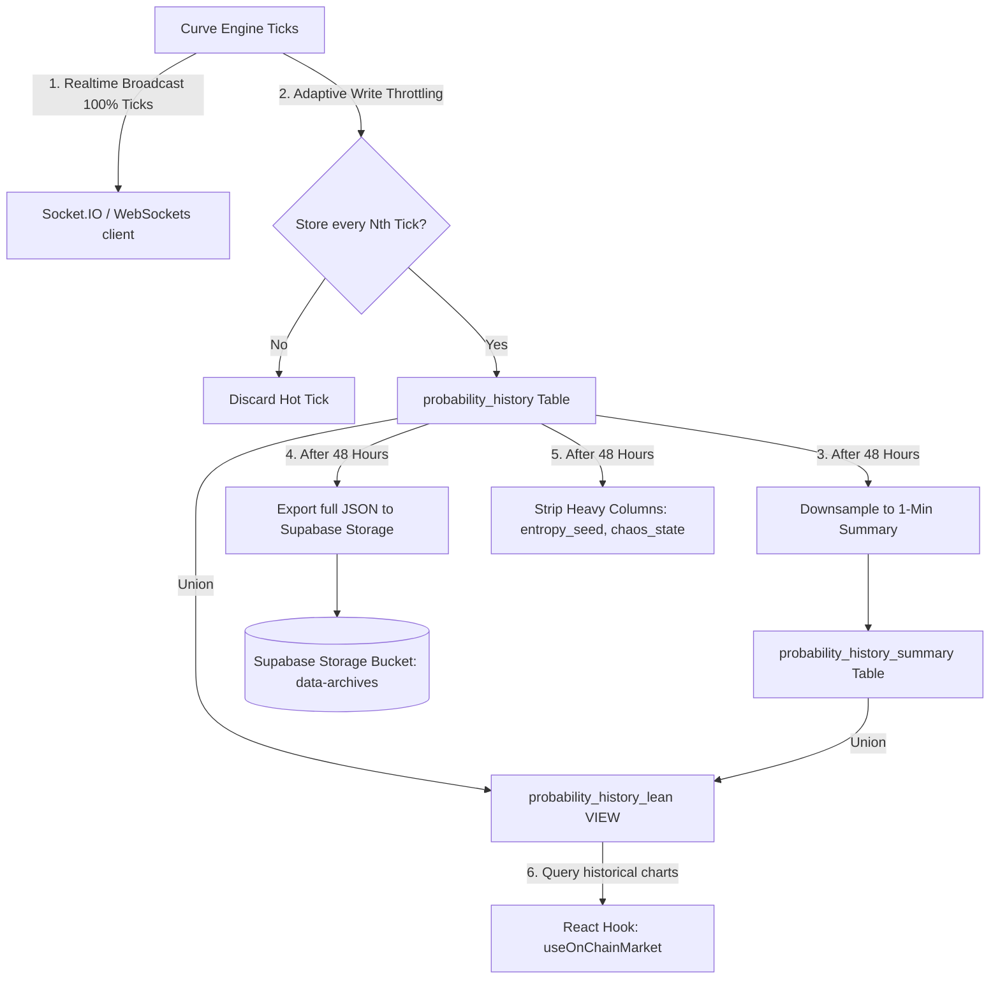

# ExoDuZe Database Storage & Platform Optimization Architecture

This document outlines the advanced storage and platform optimization architecture implemented to scale ExoDuZe to 100,000+ Monthly Active Users (MAU) while remaining within cost constraints, ensuring zero data loss of historical prediction market data, and safeguarding the platform against abuse.

---

## 1. Architectural Overview & The Challenge

ExoDuZe processes high-frequency probability ticks (every 15–30 seconds per active prediction market) generated by the Curve Engine. For dozens of active markets, this creates millions of rows per month. Under standard database patterns, this leads to:
1. **Rapid Disk Saturation**: Quick consumption of Supabase's free tier (500 MB) and high costs on paid tiers.
2. **Write Amplification & Throttling**: Heavy disk IO from continuous database inserts.
3. **Security Vulnerabilities**: High-speed automated scripts ("chunking" predictions) and replay attacks.

### The Solution: Hybrid Retention & Adaptive Throttling
We implemented a **"Never Lose Data, Never Waste Space"** strategy. We combine high-frequency WebSocket streaming for the UI with downsampled database tables, metadata stripping, automated object storage archiving, and progressive request gating.



---

## 2. Dynamic Write-Throttling (WebSocket-DB Separation)

To support real-time responsiveness without hammering the database, the Curve Engine implements a decoupled streaming architecture:

1. **100% Broadcast**: Every generated tick is immediately broadcasted to active WebSocket clients via Socket.IO. The client UI is always responsive.
2. **Adaptive DB Writes**: Ticks are only inserted into the `probability_history` table at regulated intervals, defined dynamically by market horizon in `curve_write_config`:

| Horizon | Tick Interval | Store Frequency | Database Write Rate | Write Savings |
| :--- | :--- | :--- | :--- | :--- |
| **2h** | Every 15 seconds | Save every 4th tick | Once per 60 seconds | **75% reduction** |
| **7h** | Every 30 seconds | Save every 6th tick | Once per 180 seconds | **83% reduction** |
| **12h** | Every 300 seconds | Save every 10th tick | Once per 3000 seconds | **90% reduction** |
| **24h** | Every 600 seconds | Save every 10th tick | Once per 6000 seconds | **90% reduction** |

---

## 3. Tiered Database Storage & Downsampling

### 3.1 Metadata Stripping (97% Row Size Reduction)
We preserve the historical coordinates of every tick forever to build a high-value dataset for AI training. However, heavy metadata columns (such as the raw chaotic state coordinates and seed strings) are only needed for active validation.

- **Hot Window (0–48 Hours)**: Ticks are stored with complete metadata, allowing the Curve Engine and Agents to validate predictions.
- **Warm/Cold Window (>48 Hours)**: A cron job archives the full rows to cheap Supabase Storage buckets (`data-archives`) in compressed JSON chunks.
- **In-Place Stripping**: The heavy columns (`entropy_seed`, `chaos_state`) are set to `NULL` in the primary `probability_history` table. This reduces the average row size from **~2 KB to ~60 bytes** (a **~97% disk savings**), allowing the database to host millions of rows without reaching disk limits.

### 3.2 Downsampled Summaries (`probability_history_summary`)
For settled or archived markets, loading thousands of high-resolution ticks degrades query performance. 
We introduced a downsampling process:
- A database function averages probability values into **1-minute buckets** (recording `home_avg`, `draw_avg`, `away_avg`, `home_min`, `home_max`, and `tick_count`).
- This compresses historical database size by **10x to 20x** while preserving the visual trend line of the curve.

### 3.3 Unified Lean View (`probability_history_lean`)
To prevent the frontend from displaying broken curves for older markets, we introduced a unified view:
```sql
CREATE OR REPLACE VIEW probability_history_lean AS
SELECT id::text AS id, competition_id, time_label, home, draw, away, narrative, regime, category, created_at
FROM probability_history
UNION ALL
SELECT ('summary_' || id)::text AS id, competition_id, to_char(bucket_time, 'HH12:MI:SS AM') AS time_label,
       home_avg AS home, draw_avg AS draw, away_avg AS away, narrative, regime, category, bucket_time AS created_at
FROM probability_history_summary s
WHERE NOT EXISTS (
    SELECT 1 FROM probability_history ph
    WHERE ph.competition_id = s.competition_id
    AND ph.created_at >= s.bucket_time
    AND ph.created_at < s.bucket_time + INTERVAL '1 minute'
);
```
The React hook `useOnChainMarket.ts` automatically queries `probability_history_lean`, ensuring old curves load downsampled data instantly, while active markets display real-time high-fidelity ticks.

---

## 4. Platform Security & Abuse Safeguards

### 4.1 Anti-Replay Nonce Protection (`used_nonces`)
To prevent attackers from intercepting signed API payloads and replaying them to duplicate stakes or market updates:
- Every secure write endpoint requires a unique cryptographic `nonce`.
- Nonces are validated and stored in `used_nonces` using a primary key constraint. Reused nonces are instantly rejected.
- A background worker automatically purges nonces older than 1 hour to keep the lookup index small and fast.

### 4.2 Progressive Anti-Chunking Cooldowns
"Chunking" is a bot behavior where an agent breaks predictions into rapid sub-second bursts to manipulate scoring weights or claim rewards unfairly.
The database trigger `anti_chunk_guard_v2` enforces rate limits directly at the database engine layer:
1. **Base Cooldown**: Agents must respect a minimum wait window between predictions (e.g., 60s).
2. **Violations Register**: Violations are logged in `anti_chunk_penalties` and audited in `security_events`.
3. **Progressive Doubling**: Each repeated violation doubles the required cooldown window (60s $\rightarrow$ 120s $\rightarrow$ 240s... up to a maximum of **1 hour**). Attempted inserts during this penalty window are aborted with a SQL state exception.

---

## 5. Maintenance Cron Orchestration

All cleanups and downsampling are coordinated via the NestJS `StorageOptimizationService`. It triggers a database transaction executing `run_storage_optimization_v2()` once every 24 hours:

```sql
SELECT * FROM run_storage_optimization_v2(
    48,  -- hot_retention_hours (keep full metadata for 48h)
    7,   -- warm_retention_days (keep ticks for 7 days before utilizing summary only)
    120  -- keep_per_competition (ensure last 120 raw ticks are always present)
);
```

This single transaction performs:
1. **Summarization**: Downsamples raw ticks to the minute-aggregates.
2. **Archival**: Offloads raw JSON structures to Supabase Storage.
3. **Stripping**: Clears out text/JSON parameters from raw rows.
4. **Pruning**: Deletes expired nonces, rate penalties, and old security audits.

---

## 6. High-Volume Request & Throughput Optimizations (v3.0.0)

To resolve extremely high API request traffic from background services (~1.4M requests/24h), the following platform optimizations have been implemented:

### 6.1 Idle Agent Loop Cooldown
* **Problem**: The forecasting agent loop sweeps the database for all registered agents every 15 seconds. If an agent is idle (no active deployed competitions), it queried the database to find historical entries and check auto-enrollments on every cycle, spamming the DB.
* **Optimization**: Implemented an in-memory auto-enrollment cooldown map (`lastAutoEnrollCheckTimes`) in `AgentRunnerService`. Inactive/idle agents are only permitted to scan the DB for auto-enrollments once every **5 minutes**.
* **Impact**: Reduces idle agent check overhead by **95%** (from 4 sweeps/min to 0.2 sweeps/min per agent) with zero impact on competition joining windows.

### 6.2 Batch ETL Feed Upserts
* **Problem**: The standard feed parser parsed news/pricing feeds and checked the DB for duplicates before inserting or updating records. For a feed with 30 items, this resulted in 30 `SELECT` and 30 `INSERT`/`UPDATE` requests (N+1 queries).
* **Optimization**: Refactored the ingestion logic in `BaseETLOrchestrator.upsertItems` to perform a single batch SELECT query followed by a single transactional **batch upsert** (`onConflict: 'external_id,source'`). If the batch operation fails due to schema anomalies, it automatically falls back to isolated row-by-row execution.
* **Impact**: Reduces ETL database queries by **over 95%** (2 requests instead of 60).
