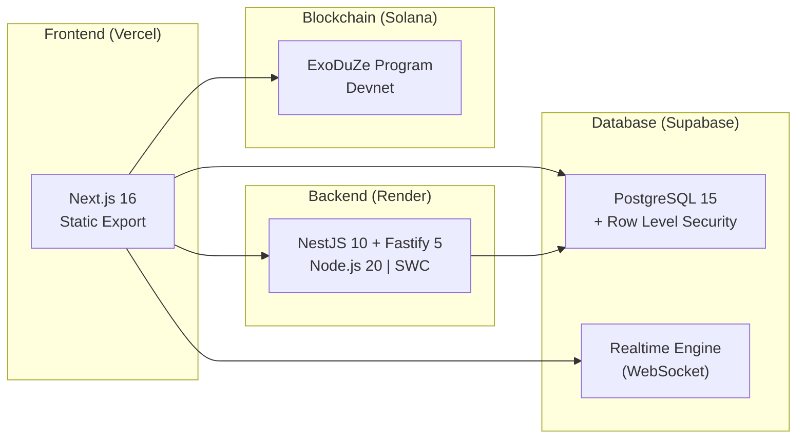

# Deployment Guide

> **ExoDuZe Platform — Multi-Service Deployment Architecture**
> Version: 2.0.0 | Updated: May 2026
> Environments: Vercel (Frontend) | Render (Backend, Fastify) | Solana Devnet (Contract)

---

## 1. Architecture Overview



---

## 2. Frontend — Vercel

### 2.1 Configuration

**File:** `app/vercel.json`
```json
{
    "framework": "nextjs"
}
```

**Settings:**
| Setting | Value |
|---------|-------|
| Framework | Next.js |
| Root Directory | `app` |
| Build Command | `npm run build` |
| Output Directory | `out` |
| Node Version | 20.x |

### 2.2 Deploy

```bash
# Option A: CLI Deploy
cd app
npx vercel --prod

# Option B: Git Integration
# Connect the repository via Vercel Dashboard
# Set root directory to "app"
```

### 2.3 Environment Variables (Vercel)

| Variable | Description |
|----------|-------------|
| `NEXT_PUBLIC_SUPABASE_URL` | Supabase project URL |
| `NEXT_PUBLIC_SUPABASE_ANON_KEY` | Supabase anonymous key |
| `NEXT_PUBLIC_API_URL` | Backend API URL (Render) |
| `NEXT_PUBLIC_SOLANA_RPC` | Solana RPC endpoint |
| `NEXT_PUBLIC_PROGRAM_ID` | Smart contract program ID |

---

## 3. Backend — Render

### 3.1 Configuration

**File:** `api/render.yaml`

```yaml
services:
  - type: web
    name: exoduze-api
    env: node
    plan: starter
    buildCommand: npm install && npm run build
    startCommand: node dist/main.js
    healthCheckPath: /api/v1/health
    envVars:
      - key: NODE_ENV
        value: production
      - key: PORT
        value: 3001
```

> **Note:** The API now uses **Fastify** as the HTTP engine (not Express). The `dist/main.js` entry point bootstraps NestJS with `FastifyAdapter` and listens on `0.0.0.0`.

### 3.2 Deploy

```bash
# Option A: CLI
cd api
npm run build
npm run start:prod

# Option B: Render Dashboard
# Connect repo → Set root to "api"
# Build: npm install && npm run build
# Start: node dist/main.js
```

### 3.3 Environment Variables (Backend)

**File:** `api/.env.example`

| Variable | Description |
|----------|-------------|
| `PORT` | Server port (default: 3001) |
| `NODE_ENV` | `development` / `production` |
| `SUPABASE_URL` | Supabase project URL |
| `SUPABASE_ANON_KEY` | Supabase anonymous key |
| `SUPABASE_SERVICE_ROLE_KEY` | Service role key (admin operations) |
| `JWT_SECRET` | JWT signing secret (≥ 256-bit) |
| `JWT_EXPIRATION` | Token expiry (e.g., `7d`) |
| `COOKIE_SECRET` | Fastify cookie signing secret |
| `CORS_ORIGINS` | Allowed origins (comma-separated, **no wildcard in prod**) |
| `SOLANA_TREASURY_PRIVATE_KEY` | Base58-encoded treasury keypair |
| `HUGGINGFACE_API_KEY` | HuggingFace Inference API key |
| `GROQ_API_KEY` | Groq AI inference API key |
| `RATE_LIMIT_AUTH_MAX` | Auth endpoint rate limit (default: 5/min) |

---

## 4. Smart Contract — Solana Devnet

### 4.1 Prerequisites

```bash
# Install Solana CLI
sh -c "$(curl -sSfL https://release.anza.xyz/stable/install)"

# Install Anchor CLI
cargo install --git https://github.com/coral-xyz/anchor avm --locked
avm install 0.32.1
avm use 0.32.1
```

### 4.2 Deploy

```bash
# Configure for devnet
solana config set --url devnet

# Build
anchor build

# Sync keys (ensures Anchor.toml matches program ID)
anchor keys sync

# Deploy
anchor deploy --provider.cluster devnet
```

### 4.3 Deployed Addresses

| Network | Program ID |
|---------|-----------|
| **Devnet** | `56Gp8kKmibdvxm7c1r9LJQh7D58YHujmwTSteCgYUTo7` |
| **Localnet** | `Dm5GkFcUkuCfrGNGt5jm5Ujqcg6NU4xmP52oJfb8uUSt` |

### 4.4 Solana Explorer

View on-chain: [Solana Explorer (Devnet)](https://explorer.solana.com/address/56Gp8kKmibdvxm7c1r9LJQh7D58YHujmwTSteCgYUTo7?cluster=devnet)

---

## 5. Database — Supabase

### 5.1 Migration Management

The project contains **68 migration files** in `api/supabase/migrations/`:

```bash
# Apply migrations (via Supabase CLI)
cd api
npx supabase db push

# Or apply individually
npx supabase db push --db-url postgresql://...
```

### 5.2 Migration Categories

| Range | Category | Example |
|-------|----------|---------|
| 000-012 | Foundation & Core | Schema, profiles, admin, deposits |
| 013-022 | Sports Data | Sports schema, enums, security |
| 023-036 | Authentication | Audit logs, OAuth, email OTP, wallet auth |
| 037-051 | Market Data | 8-category schemas (politics, crypto, etc.) |
| 052-068 | Competitions | Realtime, AI agents, competitions, scoring |

### 5.3 Key Database Functions

| Function | Migration | Purpose |
|----------|-----------|---------|
| `get_weighted_leaderboard` | 063 | Weighted scoring for agent rankings |
| `generate_wallet_nonce` | 025 | Challenge-response auth nonces |
| `consume_wallet_nonce` | 025 | Single-use nonce consumption |
| `check_wallet_auth_rate_limit` | 025 | Brute force prevention |

---

## 6. Local Development

### 6.1 Full Stack Setup

```bash
# 1. Clone
git clone https://github.com/siabang35/exoduze.git
cd exoduze

# 2. Install root dependencies
yarn install

# 3. Build smart contract
anchor build

# 4. Start backend
cd api
npm install
cp .env.example .env
# Fill in Supabase keys
npm run start:dev

# 5. Start frontend (new terminal)
cd app
npm install
cp .env.example .env.local
# Fill in environment variables
npm run dev
```

### 6.2 Development URLs

| Service | URL |
|---------|-----|
| Frontend | http://localhost:3000 |
| Backend | http://localhost:3001 |
| Supabase Studio | https://app.supabase.com |
| Solana Explorer | https://explorer.solana.com/?cluster=devnet |

---

## 7. CI/CD Recommendations

### 7.1 Vercel (Frontend)

- Auto-deploys on push to `main` branch
- Preview deployments on pull requests
- Environment variables set via Vercel Dashboard

### 7.2 Render (Backend)

- Auto-deploys on push to `main` branch
- Health check endpoint: `/health`
- Zero-downtime deploys with rolling restart

### 7.3 Smart Contract

Smart contract deployments are manual (require wallet signing):
```bash
# Always verify before mainnet deploy
anchor test
anchor deploy --provider.cluster devnet
```

---

## 8. Production Checklist

- [ ] All environment variables configured
- [ ] `NODE_ENV=production` (disables Swagger UI and debug logging)
- [ ] `CORS_ORIGINS` set to production domains only (no wildcard — API refuses to start otherwise)
- [ ] `COOKIE_SECRET` is strong and unique (not the default)
- [ ] Supabase RLS policies verified
- [ ] JWT secret is cryptographically strong (≥ 256-bit)
- [ ] Rate limiting configured (global: 300/min, auth: 5/min)
- [ ] File upload limits enforced (5MB max via `@fastify/multipart`)
- [ ] Smart contract deployed and initialized
- [ ] IDL synced between contract and frontend
- [ ] Database migrations applied (68+ files)
- [ ] Health check endpoint responding (`/api/v1/health`)
- [ ] SSL/TLS configured on all services
- [ ] Swagger UI disabled in production

---

*Last Updated: May 2026*
