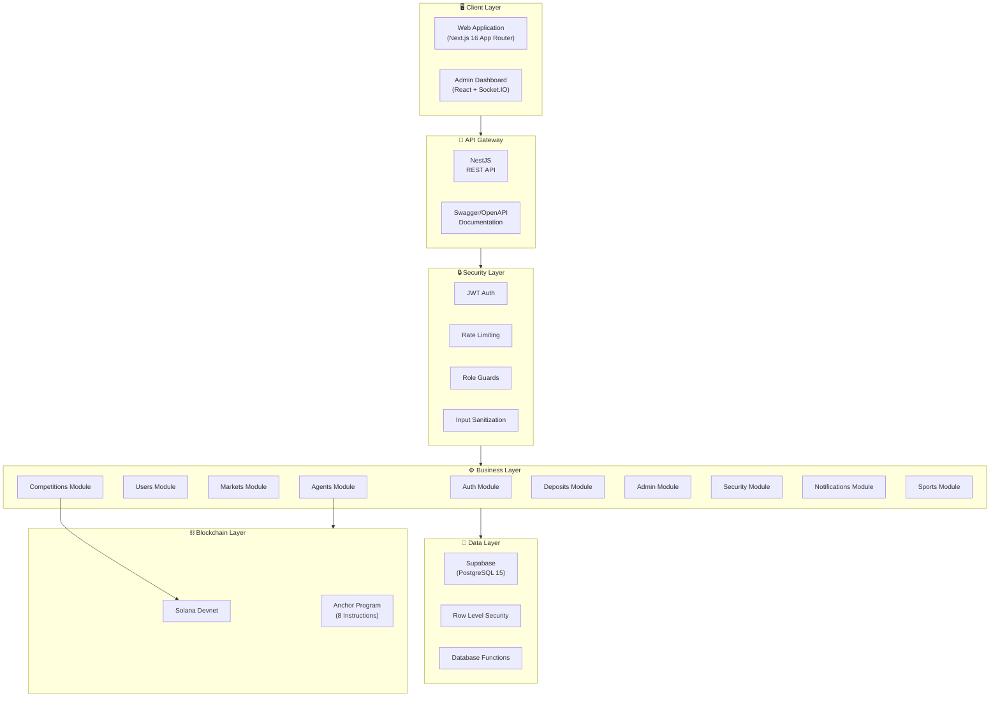
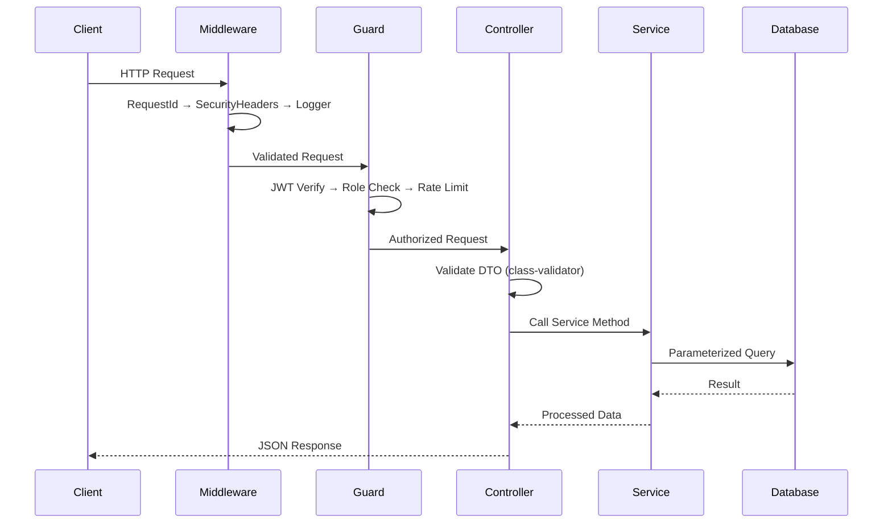
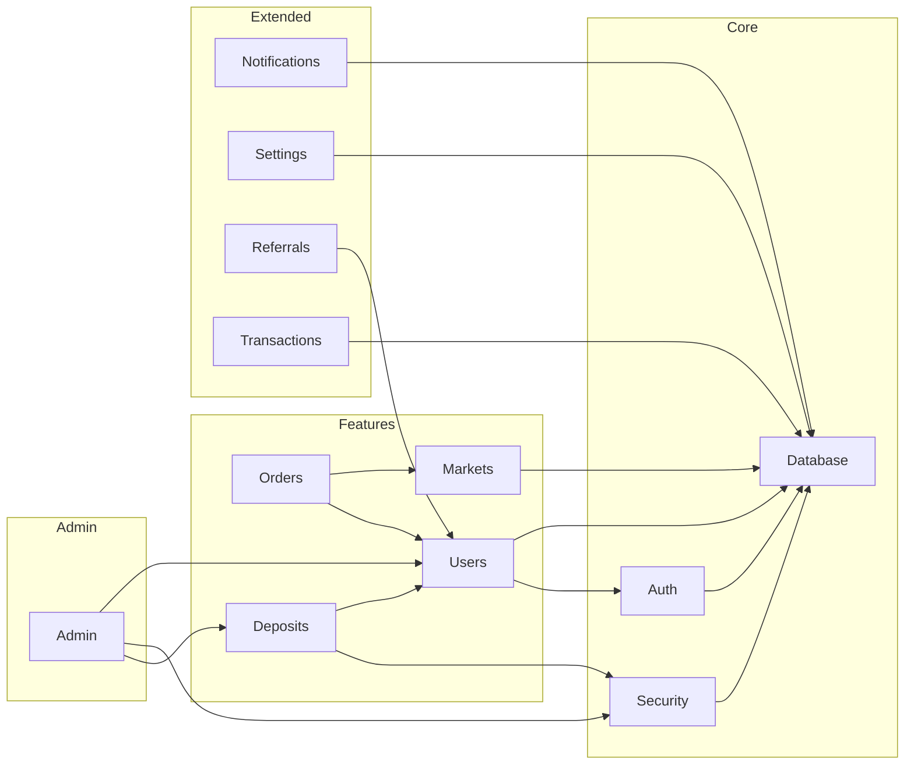
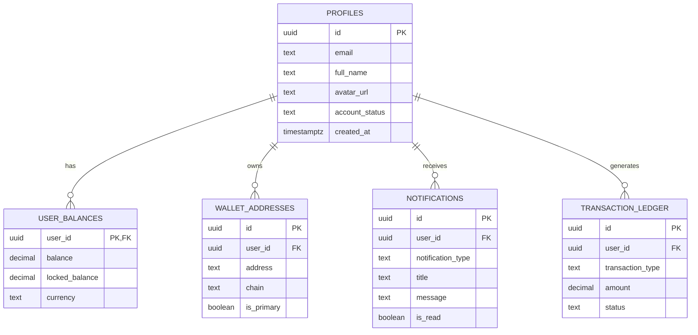
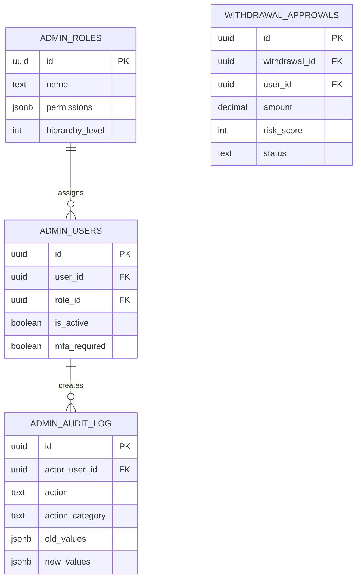

# ExoDuZe — Enterprise Technical Documentation

> **AI-Native Probability Trading Platform**  
> Version 3.0.0 | Published: May 3, 2026  
> Classification: Internal Engineering Reference

---

## Document Information

| Attribute | Value |
|-----------|-------|
| **Document Type** | Technical Architecture Blueprint |
| **Target Audience** | Engineers, Architects, DevOps |
| **Confidentiality** | Internal Use |
| **Maintainer** | ExoDuZe Engineering Team |

---

## Table of Contents

1. [Executive Summary](#1-executive-summary)
2. [System Architecture](#2-system-architecture)
3. [Technology Stack](#3-technology-stack)
4. [Real-Time Data Architecture](#4-real-time-data-architecture)
5. [Project Structure](#5-project-structure)
6. [Frontend Architecture](#6-frontend-architecture)
7. [Backend Architecture](#7-backend-architecture)
8. [Database Architecture](#8-database-architecture)
9. [Security Architecture](#9-security-architecture)
10. [Smart Contracts](#10-smart-contracts)
11. [Shared Packages](#11-shared-packages)
12. [API Reference](#12-api-reference)
13. [Deployment Architecture](#13-deployment-architecture)
14. [Appendix](#14-appendix)

---

## 1. Executive Summary

### 1.1 Platform Overview

ExoDuZe is an enterprise-grade AI Agent Competition platform enabling users to deploy autonomous AI forecasting agents and compete in probability trading on the **Solana blockchain**. The platform follows clean architecture principles with emphasis on security, scalability, and developer experience.

### 1.2 Key Capabilities

| Capability | Implementation |
|------------|----------------|
| **Solana Blockchain** | Anchor/Rust smart contract with 8 instructions, bonding curve pricing |
| **AI Agent System** | Qwen 9B-powered forecasting agents with Brier Score ranking |
| **Competition Engine** | Automated competition creation via news clustering + probability curves |
| **Wallet Auth** | Non-custodial Phantom/Solflare wallet authentication |
| **Enterprise Security** | OWASP Top 10 compliance, rate limiting, RLS, anti-throttling |
| **Admin Dashboard** | Real-time monitoring, RBAC, audit logging |

### 1.3 Architecture Highlights

- **Frontend**: Next.js 16 App Router with Vanilla CSS glassmorphic design
- **Backend**: NestJS with 16 feature modules
- **Smart Contract**: Anchor/Rust on Solana Devnet (8 instructions)
- **Database**: PostgreSQL 15 via Supabase with RLS (68 migrations)
- **AI Engine**: Qwen 9B via HuggingFace for autonomous predictions

---

## 2. System Architecture

### 2.1 High-Level Architecture



### 2.2 Request Flow



### 2.3 Design Principles

| Principle | Implementation |
|-----------|----------------|
| **Clean Architecture** | Domain, Application, Infrastructure layers |
| **SOLID** | Single responsibility per module/service |
| **DDD** | Rich domain models in `packages/domain` |
| **Security by Design** | Defense in depth, fail-secure defaults |
| **API-First** | Swagger documentation as source of truth |

---

## 3. Technology Stack

### 3.1 Core Technologies

| Layer | Technology | Version | Purpose |
|-------|------------|---------|---------|
| **Frontend** | Next.js | 16.x | App Router, SSR |
| **Styling** | Vanilla CSS | — | Glassmorphic dark theme |
| **Charts** | Chart.js | 4.x | Probability curve visualization |
| **Backend** | NestJS | Latest | Modular Node.js framework |
| **Runtime** | Node.js | 20.x LTS | Server runtime |
| **Database** | PostgreSQL | 15.x | Primary database |
| **BaaS** | Supabase | Latest | Auth, Database, Realtime |
| **Smart Contract** | Anchor | 0.32.1 | Solana program framework |
| **Language** | TypeScript / Rust | 5.x / 1.79+ | Type safety |
| **Documentation** | Swagger/OpenAPI | Latest | Hardened API documentation interface |

### 3.2 Security & Auth

| Technology | Purpose |
|------------|---------|
| **JWT** | Stateless authentication tokens |
| **Wallet Adapter** | Phantom/Solflare wallet connection |
| **class-validator** | DTO validation |
| **Helmet.js** | Security headers |
| **HMAC-SHA256** | Email verification tokens |

### 3.3 Blockchain

| Chain | Libraries |
|-------|-----------|
| **Solana** | @solana/web3.js, @coral-xyz/anchor, @solana/wallet-adapter |

### 3.4 AI & Data

| Technology | Purpose |
|------------|---------|
| **Qwen 9B** | LLM for autonomous agent predictions |
| **HuggingFace API** | Inference endpoint for AI models |
| **K-Means** | News clustering for competition generation |
| **Brier Score** | Prediction accuracy evaluation |

### 3.5 Development Tools

| Tool | Purpose |
|------|---------|
| **Yarn** | Package management |
| **Swagger** | API documentation |
| **Anchor CLI** | Solana development & testing |

---

## 4. Real-Time Data Architecture

> **Detailed Guide:** [Real-Time-Data-Architecture.md](./Real-Time-Data-Architecture.md)

| Component | Technology | Purpose |
|-----------|------------|---------|
| **ETL Pipeline** | NestJS + Cron | Aggregates data from 8 categories |
| **Image Enrichment** | ImageScraperUtil | Scrapes og:image, topic-based fallbacks |
| **Streaming** | RabbitMQ | Topic-based event distribution |
| **Gateway** | Socket.io | WebSocket broadcasting to clients |
| **Intelligence** | Recommendations | Real-time "Top Markets" ranking |

> **See Also:** [Image Scraping & ETL Enhancement](./Image-Scraping-ETL.md) for image enrichment strategies per category.

---

## 5. Project Structure

### 5.1 Repository Layout

```
my-project/
├── 📁 app/                              # Next.js 16 Frontend
│   └── 📁 src/
│       ├── 📁 app/                      # App Router pages
│       │   ├── layout.tsx               # Root layout + metadata
│       │   ├── page.tsx                 # Main dashboard
│       │   ├── globals.css              # Global stylesheet (~31KB)
│       │   ├── 📁 category/[sector]/    # Dynamic sector routes
│       │   ├── 📁 for-you/             # Personalized recommendations
│       │   ├── 📁 latest/              # Latest competitions
│       │   └── 📁 signals/             # Signal intelligence
│       ├── 📁 components/               # 15 React components
│       ├── 📁 hooks/                    # 7 Custom React hooks
│       └── 📁 lib/                      # Supabase client, Solana, IDL
│
├── 📁 api/                              # NestJS Backend API
│   ├── 📁 src/
│   │   ├── 📁 common/                  # Cross-cutting concerns
│   │   │   ├── 📁 decorators/          # Custom decorators
│   │   │   ├── 📁 filters/             # Exception filters
│   │   │   ├── 📁 guards/              # Auth/Rate guards
│   │   │   ├── 📁 interceptors/        # Request interceptors
│   │   │   └── 📁 middleware/           # HTTP middleware
│   │   ├── 📁 config/                  # Environment validation
│   │   ├── 📁 database/                # Supabase service
│   │   └── 📁 modules/                 # 16 Feature modules
│   │       ├── 📁 admin/               # Admin dashboard + RBAC
│   │       ├── 📁 agents/              # AI Agent system (18 endpoints)
│   │       ├── 📁 auth/                # JWT + Wallet auth
│   │       ├── 📁 competitions/        # Competition lifecycle
│   │       ├── 📁 dashboard/           # Dashboard APIs
│   │       ├── 📁 deposits/            # Deposit/withdrawal
│   │       ├── 📁 markets/             # Market data + ETL + signals
│   │       ├── 📁 notifications/       # User notifications
│   │       ├── 📁 orders/              # Order management
│   │       ├── 📁 referrals/           # Referral system
│   │       ├── 📁 security/            # Security services
│   │       ├── 📁 settings/            # User settings
│   │       ├── 📁 sports/              # Sports data ETL
│   │       ├── 📁 transactions/        # Transaction history
│   │       ├── 📁 users/               # User management
│   │       └── 📁 wallet/              # Wallet operations
│   └── 📁 supabase/
│       └── 📁 migrations/              # 68 SQL migration files
│
├── 📁 programs/                         # Solana Smart Contract
│   └── 📁 smart-contract/
│       └── 📁 src/
│           ├── lib.rs                   # Entry point (8 instructions)
│           ├── instructions.rs          # Instruction module registry
│           ├── state.rs                 # Account state definitions
│           ├── error.rs                 # Custom error codes (18)
│           ├── constants.rs             # Platform constants
│           └── 📁 instructions/         # Individual handlers
│               ├── initialize.rs        # Platform init + vault
│               ├── create_market.rs     # Market creation
│               ├── take_position.rs     # Position w/ bonding curve
│               ├── deploy_agent.rs      # AI agent registration
│               ├── register_agent_user.rs # Agent quota PDA
│               ├── update_probabilities.rs # Oracle updates
│               ├── settle_market.rs     # Market settlement
│               └── claim_reward.rs      # Reward distribution
│
└── 📁 documentation/                    # Technical documentation (20 files)
```

### 4.2 Module Dependency Graph



---

## 5. Frontend Architecture

> **Detailed Guide:** [Frontend-Architecture.md](./Frontend-Architecture.md)

### 5.1 Architecture Overview

The frontend is built on **Next.js 16 App Router** with **Vanilla CSS** glassmorphic design. It uses Supabase Realtime for live data and Chart.js for probability curve visualization.

| Feature | Implementation | Purpose |
|---------|----------------|---------|
| **Framework** | Next.js 16 App Router | SSR, dynamic routes, static export |
| **Data Fetching** | Supabase Realtime + apiFetch | Live subscriptions + resilient HTTP client |
| **Charts** | Chart.js + react-chartjs-2 | Real-time 3-outcome probability curves, unified agent rendering across all views |
| **State & Sorting** | React Hooks + Smart Sorting | Auto-prioritizes active, high-agent-count competitions by default on dashboards |

### 5.2 Application Structure

| Directory | Contents | Key Changes |
|-----------|----------|-------------|
| `contexts/` | Global State | Consolidates `DepositContext`, `BetSlipContext`, `AdminContext` |
| `hooks/` | Custom Hooks | Includes `useSportsMarkets` (Query+Zod), `useSportsSocket` |
| `pages/markets/` | Market Views | Modular, lazy-loaded categories (`sports/nba`, `crypto`, etc.) |
| `components/` | UI Components | Atomic design, Shadcn UI + Tailwind |

### 5.3 Component Catalog

#### Layout Components
| Component | File | Description |
|-----------|------|-------------|
| RootLayout | `layouts/RootLayout.tsx` | App-wide providers and structure |
| Header | `Header.tsx` | Main navigation and user controls |
| Sidebar | `Sidebar.tsx` | Collapsible sports navigation |
| MobileBetSlip | `MobileBetSlip.tsx` | Swipeable bottom sheet for mobile betting |

#### Core Feature Components
| Component | File | Description |
|-----------|------|-------------|
| SportsMarketCard | `SportsMarketCard.tsx` | Premium market display with live odds |
| DepositModal | `DepositModal.tsx` | Crypto deposit interface (QR, Copy) |
| AssetActionModal | `AssetActionModal.tsx` | Unified asset management |
| SettingsPage | `pages/settings/index.tsx` | User preferences & profile settings |

### 5.4 Theme System

- **Glassmorphism**: Extensive use of `backdrop-filter: blur()` and semi-transparent backgrounds.
- **Dark Mode First**: Colors optimized for dark themes (`bg-background` #0a0a1a) with high contrast accents.
- **Animations**: Framer Motion used for page transitions and micro-interactions.

```css
/* Tailwind Config (tailwind.config.js) */
colors: {
  background: "hsl(var(--background))",
  foreground: "hsl(var(--foreground))",
  primary: {
    DEFAULT: "hsl(var(--primary))",
    foreground: "hsl(var(--primary-foreground))",
  },
  // ...
}
```

---

## 6. Backend Architecture

### 6.1 Module Registry

| # | Module | Path | Endpoints | Global |
|---|--------|------|-----------|--------|
| 1 | Auth | `/auth` | 12 | No |
| 2 | Users | `/users` | 4 | No |
| 3 | Dashboard | `/dashboard` | 2 | No |
| 4 | Markets | `/markets` | 8 | No |
| 5 | **Agents** | `/agents` | 18 | No |
| 6 | **Competitions** | `/competitions` | 6 | No |
| 7 | Orders | `/orders` | 4 | No |
| 8 | Deposits | `/deposits` | 6 | No |
| 9 | **Admin** | `/admin` | 10 | No |
| 10 | **Security** | N/A | Guards | **Yes** |
| 11 | **Notifications** | `/notifications` | 7 | No |
| 12 | **Settings** | `/settings` | 9 | No |
| 13 | **Referrals** | `/referrals` | 5 | No |
| 14 | **Transactions** | `/transactions` | 4 | No |
| 15 | **Sports** | `/sports` | 5 | No |
| 16 | **Wallet** | `/wallet` | 3 | No |

> **Detailed Guides:** [AI-Agent-System.md](./AI-Agent-System.md) | [Competition-System.md](./Competition-System.md)

### 6.2 Auth Module (900+ lines)

> **Detailed Guide:** [Google-OAuth-Integration.md](./Google-OAuth-Integration.md)

**AuthService Methods:**

| Method | Purpose |
|--------|---------|
| `signup()` | Email/password registration |
| `login()` | Email/password authentication |
| `sendMagicLink()` | Passwordless email login |
| `getWalletChallenge()` | Generate signing challenge |
| `verifyWallet()` | Verify wallet signature (EVM/Solana/Sui) |
| `handleGoogleCallbackEnhanced()` | Google OAuth completion with profile check |
| `checkUsernameAvailable()` | Username availability (case-insensitive) |
| `completeGoogleProfile()` | Complete profile after OAuth |
| `generateOAuthState()` | CSRF state token generation |
| `verifyOAuthState()` | State token verification (single use) |
| `refreshTokens()` | JWT rotation |
| `getCurrentUser()` | Get user from token |
| `checkAccountLockout()` | Brute force protection |
| `logLoginAttempt()` | Security logging |

### 6.3 Middleware Stack

| Order | Middleware | Purpose |
|-------|------------|---------|
| 1 | `RequestIdMiddleware` | Generate unique request ID |
| 2 | `SecurityHeadersMiddleware` | Set security headers |
| 3 | `LoggerMiddleware` | Request/response logging |
| 4 | `InputSanitizerMiddleware` | XSS/injection prevention |

### 6.4 Guards

| Guard | Scope | Purpose |
|-------|-------|---------|
| `JwtAuthGuard` | Per-route | JWT validation |
| `AdminGuard` | Admin routes | Admin role check |
| `SuperAdminGuard` | Audit routes | Super admin only |
| `RateLimitGuard` | Per-route | Request throttling |
| `IpBlacklistGuard` | Global | Block banned IPs |
| `DeviceFingerprintGuard` | Per-route | Device tracking |

### 6.5 Interceptors

| Interceptor | Purpose |
|-------------|---------|
| `AuditLogInterceptor` | Log all mutations |

---

## 7. Database Architecture

### 7.1 Migration Registry

| # | Migration | Tables | Functions | Size |
|---|-----------|--------|-----------|------|
| 000 | Foundation | Core schema | Utilities | 14KB |
| 001 | Initial | profiles, wallets | Auth funcs | 8KB |
| 002 | Deposits | deposits, withdrawals | Balance ops | 13KB |
| 003 | Notifications | 3 tables | 5 funcs | 12KB |
| 004 | User Settings | 4 tables | 4 funcs | 13KB |
| 005 | Referrals | 3 tables, 1 view | 4 funcs | 15KB |
| 006 | Transactions | 2 tables, 2 views | 5 funcs | 16KB |
| 007 | Security | 5 tables | 7 funcs | 21KB |
| 008 | Non-Custodial | 5 tables | 6 funcs | 20KB |
| 009 | Admin | 6 tables, 3 views | 7 funcs | 29KB |
| 024 | **Google OAuth** | oauth_state_tokens | 6 funcs | 18KB |
| 033 | **Email OTP Auth** | otp_codes | OTP funcs | 8KB |
| 034 | **Fallback OTP** | fallback_otp_codes | Backup codes | 4KB |
| 036 | **Email Verified** | profiles.email_verified | Column add | 1KB |
| 047 | **OAuth Hardening** | oauth_state_tokens, oauth_jti_registry, oauth_rate_limits | 5 funcs + policies | 18KB |
| 092 | **Storage Optimization** | archive_batches, storage_health_dashboard | 4 funcs + policies | 24KB |
| 093 | **Advanced Storage & Anti-Abuse** | probability_history_summary, security_events, anti_chunk_penalties, curve_write_config, used_nonces | 4 funcs + policies | 22KB |
| 094 | **Lean Hybrid View** | probability_history_lean | 1 view | 2KB |

**Total: ~268KB of SQL, 45+ tables, 75+ functions**

### 7.2 Core Tables



### 7.3 Admin Tables



### 7.4 Row Level Security (RLS)

All tables have RLS enabled with policies:

```sql
-- User access to own data
CREATE POLICY "users_own_data" ON public.profiles
    FOR ALL USING (auth.uid() = id);

-- Service role bypass
CREATE POLICY "service_role_all" ON public.profiles
    FOR ALL USING (auth.role() = 'service_role');

-- Admin read access
CREATE POLICY "admin_read" ON public.profiles
    FOR SELECT USING (
        EXISTS (SELECT 1 FROM admin_users WHERE user_id = auth.uid() AND is_active)
    );
```

### 7.5 Database & Platform Optimization

To support high-scale operations (100,000+ MAU) without database throttling or excessive costs, a hybrid storage architecture has been implemented.

* **Decoupled Write-Throttling**: The Curve Engine broadcasts 100% of ticks via WebSockets for real-time responsiveness, but only persists every Nth tick (configured as save every 4th tick for 2h [75% reduction], every 6th tick for 7h [83% reduction], and every 10th tick for 12h/24h [90% reduction]) to the database, saving up to 90% of write operations.
* **Metadata Stripping & Archiving**: Ticks older than 48 hours are compiled into JSON format, compressed, and archived to cheap Supabase Storage (`data-archives`). The heavy coordinate columns (`entropy_seed`, `chaos_state`) are then nullified in the database, reducing row size by **~97%** to preserve historical values forever.
* **Downsampling & Lean View**: Minute-average summaries are compiled into `probability_history_summary`. Query consumers utilize `probability_history_lean`, which unions active high-res records and historical summaries seamlessly.
* **Security & Progressive Cooldowns**: Incorporates anti-replay nonce validation (`used_nonces`) and a progressive anti-chunking cooldown trigger (`anti_chunk_guard_v2`) that penalizes abusive prediction scripts by doubling wait times up to 1 hour.
* **Throughput Optimizations (v3.0.0)**:
  * **Idle Agent Cooldown**: Restricts auto-enrollment checks for idle forecasting agents to a 5-minute cooldown window, reducing sweep query volume by **95%**.
  * **Batch ETL Ingestion**: Implemented a highly optimized single-query batch upsert for incoming feeds (`onConflict: 'external_id,source'`) with dynamic fallback to isolated operations, decreasing ETL API queries by **over 95%**.

> **Detailed Guide:** [Database-Optimization-Architecture.md](./Database-Optimization-Architecture.md)

---

## 8. Security Architecture

### 8.1 OWASP Top 10 Compliance

| # | Risk | Implementation | Status |
|---|------|----------------|--------|
| A01 | Broken Access Control | RLS + Role Guards + AdminGuard | ✅ |
| A02 | Cryptographic Failures | Argon2 + JWT RS256 + AES-256 | ✅ |
| A03 | Injection | Parameterized queries + class-validator | ✅ |
| A04 | Insecure Design | Defense in depth + fail-secure | ✅ |
| A05 | Security Misconfiguration | Helmet.js + env validation | ✅ |
| A06 | Vulnerable Components | npm audit + Dependabot | ✅ |
| A07 | Auth Failures | Brute force protection + lockout | ✅ |
| A08 | Software Integrity | Signed transactions | ✅ |
| A09 | Logging Failures | AuditLogInterceptor + structured logs | ✅ |
| A10 | SSRF | No user-controlled URLs | ✅ |

### 8.2 Security Layers

```mermaid
flowchart LR
    subgraph L1["Layer 1: Network"]
        CORS["CORS"]
        HTTPS["HTTPS"]
        RateLimit["Rate Limiting"]
    end

    subgraph L2["Layer 2: Application"]
        Helmet["Security Headers"]
        Sanitizer["Input Sanitization"]
        Validator["DTO Validation"]
    end

    subgraph L3["Layer 3: Authentication"]
        JWT["JWT Tokens"]
        MFA["MFA (Optional)"]
        Lockout["Account Lockout"]
    end

    subgraph L4["Layer 4: Authorization"]
        Guards["Role Guards"]
        RLS["Row Level Security"]
        Permissions["Permission Matrix"]
    end

    subgraph L5["Layer 5: Audit"]
        AuditLog["Audit Logging"]
        SuspiciousActivity["Anomaly Detection"]
        AdminLog["Admin Actions"]
    end

    L1 --> L2 --> L3 --> L4 --> L5
```



### 8.3 Rate Limiting Configuration

| Endpoint Category | Limit | Window |
|-------------------|-------|--------|
| Authentication | 5 req | 60 sec |
| Standard API | 30 req | 60 sec |
| Read Operations | 100 req | 60 sec |
| Admin Operations | 60 req | 60 sec |
| Exports | 5 req | 300 sec |

### 8.4 Admin Role Matrix

| Permission | Super Admin | Admin | Moderator | Support | Analyst |
|------------|-------------|-------|-----------|---------|---------|
| View Users | ✅ | ✅ | ✅ | ✅ | ✅ |
| Edit Users | ✅ | ✅ | ❌ | ❌ | ❌ |
| Suspend Users | ✅ | ✅ | ✅ | ❌ | ❌ |
| Approve Withdrawals | ✅ | ✅ | ❌ | ❌ | ❌ |
| View Audit Log | ✅ | ❌ | ❌ | ❌ | ❌ |
| Export Data | ✅ | ✅ | ❌ | ❌ | ✅ |
| Manage Admins | ✅ | ❌ | ❌ | ❌ | ❌ |

---

## 9. Smart Contracts

> **Detailed Guide:** [Smart-Contract-Architecture.md](./Smart-Contract-Architecture.md)

### 9.1 Contract Overview

| Chain | Framework | Language | Path | Program ID |
|-------|-----------|----------|------|-----------|
| **Solana** | Anchor 0.32.1 | Rust | `programs/smart-contract/` | `56Gp8kKmibdvxm7c1r9LJQh7D58YHujmwTSteCgYUTo7` |

### 9.2 Instruction Set (8 Instructions)

| # | Instruction | Access | Description |
|---|-------------|--------|-------------|
| 1 | `initialize_platform` | Admin | Initialize platform PDA + Value Creation Pool vault |
| 2 | `create_market` | Admin | Create 3-way probability market with sector + bonding curve |
| 3 | `take_position` | Public | Long/Short position with bonding curve pricing |
| 4 | `register_agent_user` | Public | Create per-user AgentRegistry PDA (quota tracker) |
| 5 | `deploy_agent` | Public | Register AI agent on-chain (checks quota) |
| 6 | `update_probabilities` | Admin | Update market probabilities from Oracle/AI engine |
| 7 | `settle_market` | Admin | Settle market with winning outcome |
| 8 | `claim_reward` | Public | Claim rewards from Value Creation Pool (non-zero-sum) |

### 9.3 On-Chain Accounts (PDAs)

| Account | Seeds | Purpose |
|---------|-------|---------|
| Platform | `["platform"]` | Global state singleton |
| Vault | `["vault"]` | SOL vault for Value Creation Pool |
| Market | `["market", index]` | Individual market state |
| Position | `["position", trader, index]` | Trader's directional position |
| Agent | `["agent", owner, index]` | AI agent registration |
| AgentRegistry | `["agent_registry", user]` | Per-user deploy quota tracker |

### 9.4 Development Commands

```bash
# Build
anchor build

# Test
anchor test

# Deploy to devnet
anchor deploy --provider.cluster devnet
```

---

## 10. Documentation Index

### 10.1 Architecture Guides

| Document | Path | Description |
|----------|------|-------------|
| **Master Doc** | [Doc.md](./Doc.md) | This document — enterprise architecture overview |
| **Smart Contract** | [Smart-Contract-Architecture.md](./Smart-Contract-Architecture.md) | Anchor/Rust program: 8 instructions, PDA architecture, bonding curve |
| **Competition System** | [Competition-System.md](./Competition-System.md) | Competition lifecycle, clustering engine, curve system, Brier scoring |
| **AI Agent System** | [AI-Agent-System.md](./AI-Agent-System.md) | Agent deployment, forecasting, AgentRunner, wagering, leaderboard |
| **Frontend** | [Frontend-Architecture.md](./Frontend-Architecture.md) | Next.js 16 App Router, hooks, components, design system |
| **Security** | [Security-Architecture.md](./Security-Architecture.md) | Defense-in-depth, JWT fingerprinting, RLS, anti-throttling |
| **Database Optimization** | [Database-Optimization-Architecture.md](./Database-Optimization-Architecture.md) | Write-throttling, metadata stripping, downsampling, anti-chunking |
| **Real-Time Data** | [Real-Time-Data-Architecture.md](./Real-Time-Data-Architecture.md) | ETL pipelines, RabbitMQ, WebSocket gateways |
| **Deployment** | [Deployment-Guide.md](./Deployment-Guide.md) | Vercel, Render, Solana Devnet deployment |

### 10.2 Feature Guides

| Document | Path | Description |
|----------|------|-------------|
| **Market System** | [Market-System-Architecture.md](./Market-System-Architecture.md) | Hybrid database model, ETL orchestrator |
| **AI Recommendations** | [AI-Recommendations-System.md](./AI-Recommendations-System.md) | K-Means clustering, hotness scoring |
| **Wallet Auth** | [Wallet-Authentication-System.md](./Wallet-Authentication-System.md) | Challenge-response, multi-wallet linking |
| **RabbitMQ** | [RabbitMQ-Integration.md](./RabbitMQ-Integration.md) | Message broker architecture |
| **Admin Panel** | [Admin-Features.md](./Admin-Features.md) | Admin dashboard, Socket.IO |
| **API Integration** | [API-Integration.md](./API-Integration.md) | Sports data API documentation |
| **Guidelines** | [Guidelines.md](./Guidelines.md) | Development standards & best practices |

---

## 11. API Reference

### 11.1 Endpoint Summary

| Category | Base Path | Endpoints | Auth |
|----------|-----------|-----------|------|
| Authentication | `/auth` | 12 | Mixed |
| Users | `/users` | 4 | JWT |
| Markets | `/markets` | 5 | Mixed |
| Orders | `/orders` | 4 | JWT |
| Deposits | `/deposits` | 6 | JWT |
| Dashboard | `/dashboard` | 2 | JWT |
| Admin | `/admin` | 10 | Admin |
| Notifications | `/notifications` | 7 | JWT |
| Settings | `/settings` | 9 | JWT |
| Referrals | `/referrals` | 5 | JWT |
| Transactions | `/transactions` | 4 | JWT |

### 11.2 Authentication Endpoints

> **Detailed Guide:** [Google-OAuth-Integration.md](./Google-OAuth-Integration.md)

| Method | Path | Auth | Description |
|--------|------|------|-------------|
| POST | `/auth/signup` | Public | Register with email |
| POST | `/auth/login` | Public | Login with email |
| POST | `/auth/magic-link` | Public | Send magic link |
| POST | `/auth/wallet/challenge` | Public | Get signing challenge |
| POST | `/auth/wallet/verify` | Public | Verify signature |
| GET | `/auth/google` | Public | Initiate Google OAuth |
| GET | `/auth/google/callback` | Public | OAuth callback handler |
| POST | `/auth/google/complete-profile` | JWT | Complete profile after OAuth |
| GET | `/auth/check-username/:username` | JWT | Check username availability |
| POST | `/auth/refresh` | Public | Refresh tokens |
| POST | `/auth/logout` | JWT | Logout |
| GET | `/auth/me` | JWT | Get current user |

### 11.3 Admin Endpoints

| Method | Path | Guard | Description |
|--------|------|-------|-------------|
| GET | `/admin/stats` | Admin | Platform statistics |
| GET | `/admin/users` | Admin | List users |
| GET | `/admin/users/:id` | Admin | User details |
| PATCH | `/admin/users/:id/status` | Admin | Update status |
| GET | `/admin/withdrawals/pending` | Admin | Pending withdrawals |
| POST | `/admin/withdrawals/:id/approve` | Admin | Approve |
| POST | `/admin/withdrawals/:id/reject` | Admin | Reject |
| GET | `/admin/alerts` | Admin | System alerts |
| PATCH | `/admin/alerts/:id` | Admin | Update alert |
| GET | `/admin/audit-log` | SuperAdmin | Audit log |

---

## 12. Deployment Architecture

### 12.1 Environment Configuration

#### Backend Environment Variables

| Variable | Required | Secret | Description |
|----------|----------|--------|-------------|
| `NODE_ENV` | ✅ | ❌ | Environment mode |
| `PORT` | ✅ | ❌ | Server port (3001) |
| `SUPABASE_URL` | ✅ | ❌ | Supabase project URL |
| `SUPABASE_SERVICE_ROLE_KEY` | ✅ | ✅ | Admin API key |
| `JWT_SECRET` | ✅ | ✅ | JWT signing secret |
| `JWT_REFRESH_SECRET` | ✅ | ✅ | Refresh token secret |
| `HUGGINGFACE_API_KEY` | ✅ | ✅ | HuggingFace Inference API |
| `PROGRAM_ID` | ✅ | ❌ | Solana program ID |
| `CORS_ORIGINS` | ✅ | ❌ | Allowed origins |
| `RATE_LIMIT_MAX` | ❌ | ❌ | General rate limit |

#### Frontend Environment Variables

| Variable | Required | Default | Description |
|----------|----------|---------|-------------|
| `NEXT_PUBLIC_API_URL` | ✅ | - | Backend API URL |
| `NEXT_PUBLIC_SUPABASE_URL` | ✅ | - | Supabase project URL |
| `NEXT_PUBLIC_SUPABASE_ANON_KEY` | ✅ | - | Supabase anonymous key |
| `NEXT_PUBLIC_SOLANA_RPC` | ✅ | - | Solana RPC endpoint |
| `NEXT_PUBLIC_PROGRAM_ID` | ✅ | - | Smart contract program ID |

> **Note:** See [Deployment-Guide.md](./Deployment-Guide.md) for full deployment instructions.

### 12.2 Production URLs

| Service | URL |
|---------|-----|
| **API Backend** | `https://backend-exoduze.onrender.com/api/v1` |
| **WebSocket** | `https://backend-exoduze.onrender.com` |

### 12.3 Deployment Platforms

| Component | Recommended | Alternative |
|-----------|-------------|-------------|
| Frontend | Vercel | Netlify, Cloudflare |
| Backend | Render | Railway, Fly.io |
| Database | Supabase | Self-hosted PostgreSQL |
| Monitoring | Sentry | Datadog |

### 12.4 Production Checklist

- [ ] `NODE_ENV=production`
- [ ] JWT secrets are 256-bit minimum
- [ ] `COOKIE_SECURE=true`
- [ ] `COOKIE_SAME_SITE=strict`
- [ ] CORS limited to production domains
- [ ] Rate limiting configured
- [ ] Database SSL enabled
- [ ] All RLS policies active
- [ ] Admin user created
- [ ] Monitoring configured
- [ ] Frontend config uses production API


---

## 13. Appendix

### 13.1 Glossary

| Term | Definition |
|------|------------|
| **RLS** | Row Level Security - PostgreSQL feature for data isolation |
| **DDD** | Domain-Driven Design - Software design approach |
| **JWT** | JSON Web Token - Authentication standard |
| **OWASP** | Open Web Application Security Project |
| **EVM** | Ethereum Virtual Machine |

### 13.2 Version History

| Version | Date | Changes |
|---------|------|---------|
| 3.0.0 | May 3, 2026 | Major rewrite: Next.js 16, Solana-only, 16 modules, 8 instructions, AI agents |
| 2.1.0 | Jan 16, 2026 | Added production API configuration, centralized frontend config |
| 2.0.0 | Jan 8, 2026 | Added 6 backend modules, admin dashboard |
| 1.1.0 | Jan 7, 2026 | Initial documentation |
| 1.0.0 | Jan 6, 2026 | Project foundation |

### 13.3 Contact

| Role | Contact |
|------|---------|
| Lead Engineer | [siabang35@gmail.com] |
| Developer | [kenzonutss@gmail.com] |
| Support | [support@exoduze.com] |

---

*This document is maintained by the ExoDuZe Engineering Team. For updates or corrections, please submit a pull request.*
