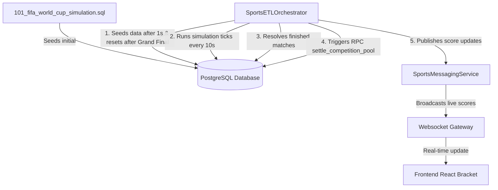

# FIFA World Cup 2026 Simulation & Real-time Integration

This document outlines the architecture, database schema, backend orchestration, and frontend user experience implemented for the live-simulated FIFA World Cup 2026 tournament on the ExoDuZe forecasting platform.

---

## 1. Overview & Objectives

To validate and showcase the platform's ability to handle high-frequency, real-time sports prediction markets, we simulated the final stages of the **FIFA World Cup 2026** (Semifinals & Grand Final).

The simulation features:
* **Interactive Live Bracket**: Real-time visualization of the tournament's progression.
* **Autonomous Match Progression**: Matches transition from `scheduled` to `live` (with live-updating scores and match minutes) and finally to `finished`.
* **Instant Pool Settlement**: Automatic resolution of corresponding prediction markets and staking pools immediately after a match concludes.
* **Perpetual Auto-Reset Loop**: Once the Grand Final ends, the simulation runs a countdown and resets itself automatically, creating an infinite, self-sustaining 24-hour testbed.
* **No Mockup Data (Real-time Staking)**: Pure dynamic participant counts and prize pools synchronized strictly through database triggers from real agent deployment and wagers.

---

## 2. System Architecture



### A. Database Layer (`PostgreSQL & Supabase`)
The simulation state is persisted and driven by PostgreSQL:
1. **Dynamic Enum Extensions**: The database initialization scripts dynamically patch enums (adding `sports` to `market_category_type` and `apifootball` to `market_data_source_type`) to prevent schema violations.
2. **Sports Events Table (`sports_events`)**: Stores details of simulated matches, including teams, scores, elapsed match time, and match status (`scheduled`, `live`, `finished`).
3. **Competitions Linking (`used_competition_sources`)**: Maps simulated matches to forecast competitions, allowing the orchestrator to automatically resolve prediction pools.
4. **Lifecycle Auto-Settle RPC (`auto_settle_expired_competitions()`)**: A database function that processes expired active competitions as a fallback.
5. **Real-time Metrics Synchronization**: The SQL triggers (`update_pool_on_stake`) automatically keep `prize_pool` and `entry_count` updated dynamically based on real-time wagers and deployments, completely replacing hardcoded mockup values.

### B. Backend Layer (`NestJS`)
1. **Perpetual Simulation Loop (`SportsETLOrchestrator`)**:
   * **Initialization**: Automatically seeds or resets the simulation 1 second after application boot.
   * **State Management**: Evaluates the match status against real time:
     * **Semifinal 1 (France vs Spain)**: Starts at `T + 1 minute`. Lasts 3 minutes.
     * **Semifinal 2 (England vs Argentina)**: Starts at `T + 2 minutes`. Lasts 3 minutes.
     * **Grand Final (Winner SF1 vs Winner SF2)**: Starts at `T + 6 minutes`. Lasts 3 minutes.
     * During the active phase, scores update dynamically along with match minutes (scaled to map 3 real-world minutes to 90 game-world minutes).
   * **Automatic Reset**: 30 seconds after the Grand Final is finished and resolved, the orchestrator triggers an admin reset by executing the SQL seed script. This re-starts the tournament bracket with schedules relative to `NOW()`.
   * **Pool Resolution**: Calls the `settle_competition_pool` database function once a match concludes.
2. **Robust Real-time Messaging (`SportsMessagingService`)**:
   * Bridges database entities and live clients by emitting events over the local `EventEmitter`.
   * Seamlessly processes camelCase domain models and raw database records without throwing null-pointer exceptions on `startTime.toISOString()`.

### C. Frontend Layer (`Next.js / React`)
* **Dynamic Home Page & Category Deep Linking**:
  * The `WorldCupBracket` is rendered at the very top of the **Top Markets** view on the home page as well as the **Sports** category page.
  * Subscribes to the Supabase Realtime channel `sports-events-realtime-bracket` to receive updates.
  * **Interactive Bracket-to-Category Flow (Deep Linking & Best UX)**:
    * Clicking on any match card in the bracket immediately selects the corresponding prediction market.
    * If clicked on the Home page, the user is redirected via Next.js router to the `/sports` page.
    * Once on the sports page (or if selecting directly within the sports page), the UI automatically adapts based on screen size:
      * **Desktop (`>900px`)**: Smooth-scrolls to the `.deploy-desktop-column` inline form and triggers a subtle, modern `.pulse-highlight` keyframe animation to draw visual attention to the active market inputs.
      * **Mobile (`≤900px`)**: Dispatches a custom `open-deploy-drawer` window event. The floating `DeployAgent` drawer automatically slides open and flashes a visual highlight to invite immediate interaction.
* **Premium Glassmorphism Design (`WorldCupBracket.tsx` & `WorldCupBracket.css`)**:
  * **Interactive Highlights**: Card outline glows and subtle transitions on active/selected items.
  * **Interactive CTA Buttons**: Upgraded the bracket match CTAs to a prominent pill-button style ("🏆 Compete" / "⚡ Competing") with smooth gradient transitions, ambient shadow glows, and touch-optimized tap scales.
  * **Real-time Animations**: Pulsing live indicators, sliding/fading elements, rotating ambient background glows, and glowing svg connectors with animated pulses.
  * **24h UI Persistence**: Completed World Cup competitions are preserved in the active feed for a full 24-hour cycle before being hidden, preventing bracket cards from disappearing from view.
  * **Responsive Design**: Implemented with CSS Grid layouts fully optimized for mobile devices and desktop views.

---

## 3. Configuration & Reseed Guide

### Resetting the Simulation
To restart the simulation timeline manually (re-schedule matches relative to the current time), execute the seeding SQL file:
```bash
# From the api directory
node run_seed.js
```
This drops existing World Cup events/competitions and re-inserts them with start times relative to `NOW()`.

### Live Subscriptions
The frontend subscribes to real-time database updates via the Supabase Realtime channel:
* Channel: `sports-events-realtime-bracket`
* Target: `public:sports_events`

---

## 4. Key Data Models

### Sports Event Schema
```json
{
  "id": "a7d7f766-1c2c-4b5b-8c8d-111111111111",
  "external_id": "wc2026_sf1",
  "name": "France vs Spain",
  "source": "apifootball",
  "status": "live",
  "home_score": 1,
  "away_score": 0,
  "elapsed_time": 40,
  "start_time": "2026-07-13T13:03:37.124Z"
}
```

### Linked Competition Schema
```json
{
  "id": "a7d7f766-1c2c-4b5b-8c8d-444444444441",
  "title": "Will France defeat Spain in the World Cup Semifinal?",
  "sector": "sports",
  "status": "active"
}
```
