# Smart Contract Architecture

> **ExoDuZe Solana Program — Anchor/Rust**
> Program ID: `56Gp8kKmibdvxm7c1r9LJQh7D58YHujmwTSteCgYUTo7` (Devnet)
> Framework: Anchor 0.32.1 | Rust 1.79+

---

## 1. Overview

The ExoDuZe smart contract is the on-chain backbone of the probability trading platform. It manages market creation, position taking with bonding curve pricing, AI agent deployment with quota management, market settlement, and reward distribution from the Value Creation Pool.

### Key Design Principles

| Principle | Implementation |
|-----------|---------------|
| **Non-Zero-Sum** | Even losing positions receive 50% refund from the pool |
| **Bonding Curve Pricing** | Position cost increases with market supply (linear approximation) |
| **Agent Quota System** | Per-user PDA limits agent deploys (10 free tier) |
| **Competition Timing** | Markets enforce `competition_start` and `competition_end` timestamps |
| **Sector Categorization** | Markets are tagged by sector (finance, crypto, tech, etc.) |

---

## 2. Program Architecture

```mermaid
graph TB
    subgraph Program["ExoDuZe Program"]
        Init["initialize_platform"]
        CreateMkt["create_market"]
        TakePos["take_position"]
        RegAgent["register_agent_user"]
        DeployAg["deploy_agent"]
        UpdateP["update_probabilities"]
        Settle["settle_market"]
        Claim["claim_reward"]
        StakePool["stake_pool"]
        ClaimPool["claim_pool_prize"]
        AdminDisburse["admin_disburse_prize"]
    end

    subgraph PDAs["Program Derived Accounts"]
        Platform["Platform PDA<br/>(seeds: 'platform')"]
        Market["Market PDA<br/>(seeds: 'market' + index)"]
        Position["Position PDA<br/>(seeds: 'position' + trader + index)"]
        Agent["Agent PDA<br/>(seeds: 'agent' + owner + index)"]
        Registry["AgentRegistry PDA<br/>(seeds: 'agent_registry' + user)"]
        Vault["Vault PDA<br/>(seeds: 'vault')"]
        PoolPDA["CompetitionPool PDA<br/>(seeds: 'competition_pool' + market)"]
        PoolVault["Pool Vault PDA<br/>(seeds: 'pool_vault' + market)"]
    end

    Init --> Platform
    Init --> Vault
    CreateMkt --> Market
    TakePos --> Position
    TakePos --> Vault
    RegAgent --> Registry
    DeployAg --> Agent
    DeployAg --> Registry
    Claim --> Vault
    StakePool --> PoolPDA
    StakePool --> PoolVault
    ClaimPool --> PoolVault
    AdminDisburse --> PoolVault
```



---

## 3. State Accounts

### 3.1 Platform (Root State)

The singleton root account storing global platform state.

```rust
pub struct Platform {
    pub admin: Pubkey,        // Platform administrator
    pub pool_balance: u64,    // Value Creation Pool balance (lamports)
    pub total_markets: u64,   // Counter for market PDA derivation
    pub total_positions: u64, // Counter for position PDA derivation
    pub total_agents: u64,    // Counter for agent PDA derivation
    pub bump: u8,             // PDA bump seed
}
```

### 3.2 Market

Represents a 3-way probability trading market with sector tagging, competition timing, and bonding curve parameters.

```rust
pub struct Market {
    pub authority: Pubkey,
    pub title: String,            // max 64 chars
    pub team_home: String,        // max 32 chars
    pub team_away: String,        // max 32 chars
    pub probabilities: [u16; 3],  // basis points [Home, Draw, Away], sum = 10000
    pub status: MarketStatus,     // Active | Paused | Settled
    pub winning_outcome: Option<Outcome>,
    pub total_positions: u64,
    pub total_volume: u64,        // total lamports traded
    pub market_index: u64,
    pub created_at: i64,
    pub settled_at: Option<i64>,
    pub sector: String,           // max 20 chars (finance, crypto, tech, etc.)
    pub competition_start: i64,   // unix timestamp
    pub competition_end: i64,     // unix timestamp
    pub bonding_k: u64,           // bonding curve base price multiplier
    pub bonding_n: u16,           // bonding curve exponent × 100
    pub bump: u8,
}
```

### 3.3 Position

A trader's directional position on a specific market outcome.

```rust
pub struct Position {
    pub trader: Pubkey,
    pub market: Pubkey,
    pub outcome: Outcome,           // Home | Draw | Away
    pub direction: Direction,       // Long | Short
    pub entry_probability: u16,     // probability at time of entry (basis points)
    pub current_probability: u16,
    pub amount: u64,                // effective amount (includes bonding premium)
    pub unrealized_pnl: i64,
    pub realized_pnl: i64,
    pub is_claimed: bool,
    pub position_index: u64,
    pub created_at: i64,
    pub bump: u8,
}
```

### 3.4 Agent

An AI agent deployed on-chain with a strategy prompt.

```rust
pub struct Agent {
    pub owner: Pubkey,
    pub market: Pubkey,
    pub strategy_prompt: String,     // max 256 chars
    pub target_outcome: Outcome,
    pub direction: Direction,
    pub risk_level: u8,              // 1-5
    pub accuracy_score: u16,
    pub total_trades: u64,
    pub is_active: bool,
    pub agent_index: u64,
    pub created_at: i64,
    pub bump: u8,
}
```

### 3.5 AgentRegistry

Per-user quota tracker for AI agent deployments.

```rust
pub struct AgentRegistry {
    pub user: Pubkey,
    pub deploys_used: u8,    // current usage
    pub max_deploys: u8,     // 10 for free tier
    pub bump: u8,
}
```

### 3.6 LeaderboardEntry

On-chain leaderboard record for trader rankings.

```rust
pub struct LeaderboardEntry {
    pub trader: Pubkey,
    pub total_return: i64,
    pub accuracy: u16,
    pub total_trades: u64,
    pub rank: u32,
    pub bump: u8,
}
```

---

## 4. Enums

```rust
pub enum MarketStatus { Active, Paused, Settled }
pub enum Direction   { Long, Short }
pub enum Outcome     { Home, Draw, Away }
```

---

## 5. Instructions

### 5.1 `initialize_platform`

Initializes the platform root PDA and vault. Optionally deposits SOL into the Value Creation Pool.

| Parameter | Type | Description |
|-----------|------|-------------|
| `pool_deposit` | `u64` | Initial SOL deposit (lamports) for the Value Creation Pool |

**Accounts:**
- `admin` (Signer, Mutable) — Platform administrator
- `platform` (Init PDA) — Root state account
- `vault` (PDA) — SOL vault for the pool

---

### 5.2 `create_market`

Creates a new 3-way probability market. Admin only.

| Parameter | Type | Constraint |
|-----------|------|------------|
| `title` | `String` | ≤ 64 chars |
| `team_home` | `String` | ≤ 32 chars |
| `team_away` | `String` | ≤ 32 chars |
| `initial_probabilities` | `[u16; 3]` | Must sum to 10000 |
| `sector` | `String` | ≤ 20 chars |
| `competition_start` | `i64` | Unix timestamp |
| `competition_end` | `i64` | Must be > start |
| `bonding_k` | `u64` | Bonding curve k parameter |
| `bonding_n` | `u16` | Bonding curve n parameter |

**PDA Derivation:** `seeds = [MARKET_SEED, total_markets.to_le_bytes()]`

---

### 5.3 `take_position`

Takes a Long/Short position on a market outcome with bonding curve pricing.

| Parameter | Type | Constraint |
|-----------|------|------------|
| `outcome` | `u8` | 0=Home, 1=Draw, 2=Away |
| `direction` | `u8` | 0=Long, 1=Short |
| `amount` | `u64` | ≥ 0.01 SOL (10,000,000 lamports) |

**Bonding Curve Logic:**
```
bonding_premium = bonding_k × total_positions / BONDING_PRECISION
effective_amount = amount + bonding_premium
```

The premium increases linearly with market supply, creating a sigmoid-like cost curve that incentivizes early participation.

**Timing Enforcement:**
- Rejects if `now < competition_start`
- Rejects if `now >= competition_end`

---

### 5.4 `register_agent_user`

Creates a per-user AgentRegistry PDA to track deployment quota. Must be called before `deploy_agent`.

**PDA Derivation:** `seeds = [AGENT_REGISTRY_SEED, user.key()]`

Initializes with `deploys_used = 0` and `max_deploys = 10`.

---

### 5.5 `deploy_agent`

Registers an AI agent on-chain with a strategy prompt. Checks quota against AgentRegistry.

| Parameter | Type | Constraint |
|-----------|------|------------|
| `strategy_prompt` | `String` | ≤ 256 chars |
| `target_outcome` | `u8` | 0=Home, 1=Draw, 2=Away |
| `direction` | `u8` | 0=Long, 1=Short |
| `risk_level` | `u8` | 1-5 |

**Quota Check:** `registry.deploys_used < registry.max_deploys`

---

### 5.6 `update_probabilities`

Admin-only instruction to update market probabilities based on Oracle/AI engine data.

| Parameter | Type | Constraint |
|-----------|------|------------|
| `new_probabilities` | `[u16; 3]` | Must sum to 10000 |

---

### 5.7 `settle_market`

Admin-only instruction to settle a market by declaring the winning outcome.

| Parameter | Type | Constraint |
|-----------|------|------------|
| `winning_outcome` | `u8` | 0=Home, 1=Draw, 2=Away |

Sets `status = Settled` and records `settled_at` timestamp.

---

### 5.8 `claim_reward`

Processes reward claims from the Value Creation Pool.

**Reward Formula (Correct Direction):**
```
prob_shift = |final_probability - entry_probability|
base_reward = amount × prob_shift / 10000
reward_with_multiplier = base_reward × 1.5
total_payout = original_amount + reward_with_multiplier
```

**Non-Zero-Sum (Incorrect Direction):**
```
refund = original_amount × 50%
```

Even losing traders receive 50% of their position back, ensuring the platform operates on a non-zero-sum basis.

---

### 5.9 `stake_pool`

Stakes SOL into a competition pool vault PDA. Creates a `CompetitionPool` state if it doesn't exist, or updates the existing pool.

| Parameter | Type | Constraint |
|-----------|------|------------|
| `amount` | `u64` | ≥ 0.01 SOL, ≤ 10 SOL (anti-whale) |

**Fee Structure:**
- Platform fee: 2% (200 bps) deducted from stake
- Distributable pool: 98% of total staked

**Accounts:**
- `staker` (Signer, Mutable) — User staking SOL
- `market` (Account) — Associated market
- `competition_pool` (Init/Mutable PDA) — Pool state account
- `pool_vault` (Mutable PDA) — SOL custody vault
- `system_program` — For SOL transfer CPI

---

### 5.10 `claim_pool_prize`

Claims winnings from a settled competition pool. Only winning positions (correct direction on winning outcome) can claim.

**Prize Calculation (v2 — Fixed):**
```
prize = (user_stake / total_staked) × distributable_pool
transfer = min(prize, remaining_distributable)
```

> **v2 Fix:** Removed the 1.5x `POOL_MULTIPLIER` that could cause total claims to exceed vault balance. Prizes are now a proportional share of the distributable pool.

**Security:**
- Uses `invoke_signed` with PDA seeds for vault withdrawal (not raw lamport manipulation)
- Validates market is settled, pool is settled, position is not already claimed
- Caps transfer to remaining distributable pool (rounding safety net)

**Accounts:**
- `claimant` (Signer, Mutable) — Winner claiming prize
- `market` (Account) — Must be `Settled` status
- `competition_pool` (Mutable PDA) — Must be settled
- `position` (Mutable Account) — Must be winner's unclaimed position
- `pool_vault` (Mutable PDA) — SOL vault, uses PDA signing for withdrawal
- `system_program` — For CPI transfer

---

### 5.11 `admin_disburse_prize`

Admin-only instruction for automated prize disbursement. Called by the backend settlement cron after determining winners via weighted leaderboard scoring.

| Parameter | Type | Description |
|-----------|------|-------------|
| `amount` | `u64` | Prize amount in lamports |

**Authorization:** Validates `admin == platform.admin` (has_one constraint).

**Security:**
- Platform `has_one = admin` constraint prevents unauthorized callers
- Pool must be settled (`is_settled = true`)
- Amount must be ≤ `distributable_pool` (balance check)
- Uses `invoke_signed` with PDA seeds for vault withdrawal

**Accounts:**
- `admin` (Signer, Mutable) — Platform admin
- `platform` (Account PDA) — Platform state with admin pubkey
- `competition_pool` (Mutable PDA) — Must be settled
- `market` (Account) — Associated market
- `pool_vault` (Mutable PDA) — SOL vault
- `winner` (Mutable AccountInfo) — Recipient wallet
- `system_program` — For CPI transfer

---

## 6. PDA Seed Architecture

| Account | Seeds | Derived From |
|---------|-------|--------------|
| Platform | `["platform"]` | Global singleton |
| Vault | `["vault"]` | Global singleton (holds SOL) |
| Market | `["market", market_index]` | Incrementing counter |
| Position | `["position", trader, position_index]` | Per-user counter |
| Agent | `["agent", owner, agent_index]` | Global counter |
| AgentRegistry | `["agent_registry", user]` | Per-user singleton |
| Leaderboard | `["leaderboard"]` | Global singleton |
| CompetitionPool | `["competition_pool", market.key()]` | Per-market singleton |
| Pool Vault | `["pool_vault", market.key()]` | Per-market SOL custody |

---

## 7. Constants

| Constant | Value | Description |
|----------|-------|-------------|
| `PROBABILITY_DECIMALS` | 10,000 | 100.00% = 10000 basis points |
| `POOL_MULTIPLIER` | 150 | 1.5× reward multiplier (÷100) — **deprecated**, no longer used in pool claims |
| `PLATFORM_FEE_BPS` | 200 | 2% platform fee |
| `MIN_POSITION_AMOUNT` | 10,000,000 | 0.01 SOL minimum |
| `MAX_POSITION_AMOUNT` | 10,000,000,000 | 10 SOL max per position (anti-whale) |
| `MAX_FREE_DEPLOYS` | 10 | Free tier agent deploy limit |
| `MAX_OUTCOMES` | 3 | Home, Draw, Away |
| `BONDING_BASE_PRICE` | 100,000 | 0.0001 SOL base |
| `BONDING_PRECISION` | 1,000,000 | 6-decimal math precision |

---

## 8. Error Codes

| Error | Code | Description |
|-------|------|-------------|
| `TitleTooLong` | 6000 | Title exceeds 64 characters |
| `TeamNameTooLong` | 6001 | Team name exceeds 32 characters |
| `StrategyTooLong` | 6002 | Strategy prompt exceeds 256 characters |
| `InvalidProbabilities` | 6003 | Probabilities don't sum to 10000 |
| `MarketNotActive` | 6004 | Market is not in Active status |
| `MarketNotSettled` | 6005 | Market is not in Settled status |
| `MarketAlreadySettled` | 6006 | Market has already been settled |
| `InvalidOutcome` | 6007 | Outcome index must be 0, 1, or 2 |
| `InvalidDirection` | 6008 | Direction must be 0 (Long) or 1 (Short) |
| `AmountTooSmall` | 6009 | Position below 0.01 SOL minimum |
| `InsufficientPoolFunds` | 6010 | Vault has insufficient SOL for reward / pool balance |
| `AlreadyClaimed` | 6011 | Position reward already claimed |
| `Unauthorized` | 6012 | Caller is not admin / not position owner |
| `InvalidRiskLevel` | 6013 | Risk level must be 1-5 |
| `MathOverflow` | 6014 | Arithmetic overflow detected |
| `AgentDeployLimitReached` | 6015 | User exceeded free deploy quota |
| `CompetitionNotStarted` | 6016 | Competition hasn't started yet |
| `CompetitionEnded` | 6017 | Competition has already ended |
| `SectorTooLong` | 6018 | Sector name exceeds 20 characters |
| `PoolNotSettled` | 6019 | Competition pool not yet settled |
| `AmountTooLarge` | 6020 | Position exceeds 10 SOL anti-whale limit |

---

## 9. Deployment

### Configuration

```toml
# Anchor.toml
[programs.devnet]
exoduze = "56Gp8kKmibdvxm7c1r9LJQh7D58YHujmwTSteCgYUTo7"

[programs.localnet]
exoduze = "Dm5GkFcUkuCfrGNGt5jm5Ujqcg6NU4xmP52oJfb8uUSt"

[provider]
cluster = "devnet"
wallet = "~/.config/solana/id.json"
```

### Build & Deploy

```bash
# Build the program
anchor build

# Sync program keys
anchor keys sync

# Deploy to devnet
solana config set --url devnet
anchor deploy --provider.cluster devnet
```

### IDL

The generated IDL is stored at `app/src/lib/idl/exoduze.json` and is used by the frontend for on-chain interactions via `@coral-xyz/anchor`.

---

## 10. Deployment History

| Date | TX Signature | Type | Changes |
|------|-------------|------|---------|
| 2026-05-09 | `4a5gM86T...8b2Vo` | Upgrade | Added `admin_disburse_prize`, fixed `claim_pool_prize` (removed 1.5x multiplier, PDA invoke_signed), registered pool subsystem |

---

*Last Updated: 2026-05-09 — Pool Settlement Hardening*
