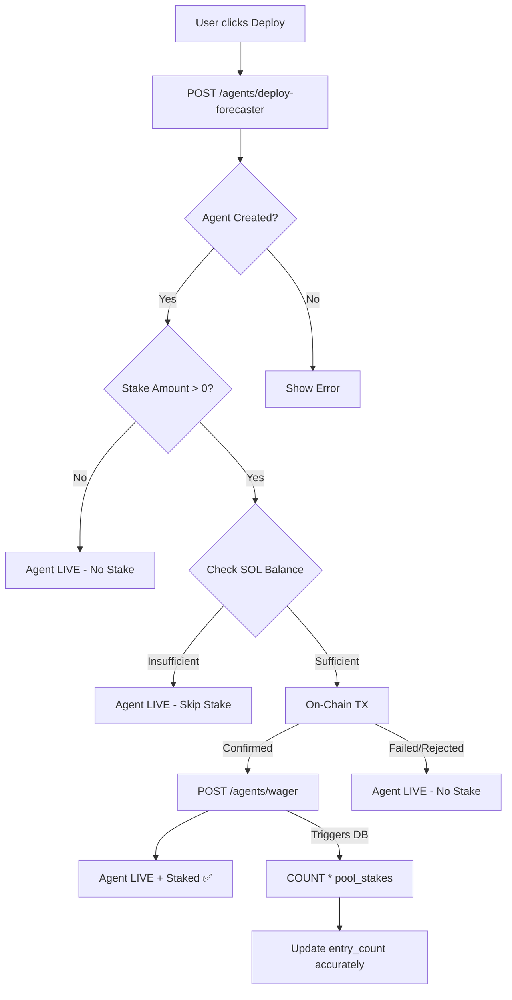

# Stake Integrity System

> **Decoupled Deployment, Verifiable On-Chain Entry, and Anti-Drift Architecture**
> Version: 1.1.0 | Published: May 2026

---

## 1. Overview

The **Stake Integrity System** ensures that participation numbers (`entry_count`) and prize pool values perfectly match the actual confirmed Solana transactions. It addresses the fundamental challenge of ensuring that off-chain database counters do not drift from the on-chain reality when transactions fail, are rejected, or are simulated.

This system guarantees that:
1. **Agent deployments never fail due to stake errors** (insufficient funds, user rejections).
2. **Ghost entries are impossible** — only confirmed on-chain transactions increase the entry count.
3. **Database triggers are drift-proof** — using aggregate queries instead of naive increments.

---

## 2. Core Problem: The "Ghost Entry" Drift

In earlier versions, the platform used a coupled approach:
- Deploying an agent and staking SOL were a single atomic frontend action.
- If the Solana transaction failed (e.g., insufficient SOL), the system created a "fallback" backend-only wager to ensure the agent still deployed.
- A naive database trigger `stake_count = stake_count + 1` ran for every insert, including these fallback wagers.
- **Result:** The `entry_count` showed 5 participants, but only 3 had actually staked SOL, leading to UI discrepancies and diluted prize pool calculations.

---

## 3. The Solution: Stake-Deploy Decoupling

### 3.1 Frontend Architecture (`DeployAgent.tsx`)

The frontend workflow has been heavily modified to decouple agent deployment from financial staking:

1. **Pre-flight Balance Checks**: Before any Solana transaction is attempted, the frontend checks the user's devnet SOL balance against the required stake + gas fees.
2. **Strict Success Gates**: The backend `/agents/wager` endpoint is **ONLY** called if `DEVNET_CONNECTION.confirmTransaction()` returns a success state.
3. **No Fallbacks**: Fallback logic for creating "dummy" or "simulated" stakes has been entirely removed.
4. **Stake-Aware UI**: The system displays different success messages based on the stake outcome:
   - *Staked*: "💎 Staked X SOL on-chain — competing for prize pool!"
   - *Not Staked*: "📋 Deployed without stake — you can stake SOL anytime to enter the prize pool"

### 3.2 Database Trigger Architecture (`073_fix_pool_stake_count_drift.sql`)

Naive counter increments are vulnerable to race conditions, transaction rollbacks, and manual row deletions. The database trigger `update_pool_on_stake()` was rewritten to use aggregate calculations from the source of truth (`pool_stakes`).

#### Old (Vulnerable to Drift):
```sql
UPDATE competition_pools
SET stake_count = stake_count + 1
WHERE id = NEW.pool_id;
```

#### New (Drift-Proof):
```sql
-- 1. Count ACTUAL valid rows
SELECT COUNT(*), COALESCE(SUM(stake_amount), 0)
INTO v_actual_count, v_actual_total
FROM pool_stakes
WHERE pool_id = NEW.pool_id AND status = 'active';

-- 2. Update with exact aggregate values
UPDATE competition_pools
SET 
    total_staked = v_actual_total,
    stake_count = v_actual_count
WHERE id = NEW.pool_id;
```

---

## 4. System Flow



---

## 5. Security & Verification

### 5.1 Verifiable On-Chain Hashes
Every record in the `pool_stakes` table must possess a valid `onchain_tx` signature. These signatures are real Solana devnet transaction hashes that can be verified on [Solscan](https://solscan.io/?cluster=devnet).

### 5.2 Anti-Whale Enforcement
Even with the new drift-proof triggers, the `validate_stake()` trigger still runs before inserts to ensure:
- Users cannot stake more than `5.00 SOL` per competition.
- Users cannot have more than `1` active stake per competition.

### 5.3 Retroactive Synchronization
The migration file `073_fix_pool_stake_count_drift.sql` includes a retroactive cleanup script that forces all existing `competition_pools` and `competitions` to recalculate their totals based on the actual rows in `pool_stakes`, instantly fixing any existing drift.

---

*Engineered for trustless execution on Solana Devnet.*
