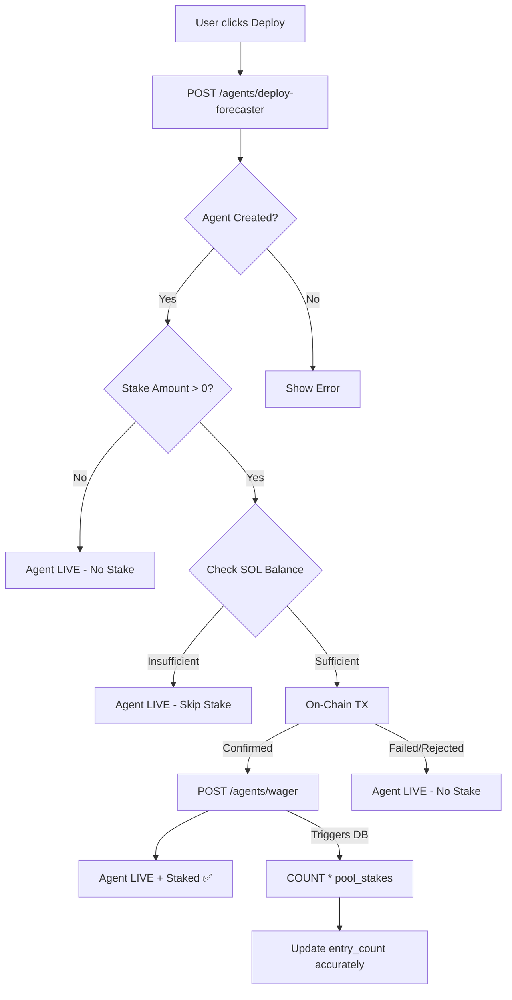

# Stake Integrity System

> **Decoupled Deployment, Verifiable On-Chain Entry, and Anti-Drift Architecture**
> Version: 1.2.0 | Published: May 2026

---

## 1. Overview

The **Stake Integrity System** ensures that participation numbers (`entry_count`) and prize pool values perfectly match the actual confirmed Solana transactions. It addresses the fundamental challenge of ensuring that off-chain database counters do not drift from the on-chain reality when transactions fail, are rejected, or are simulated.

This system guarantees that:
1. **Agent deployments never fail due to stake errors** (insufficient funds, user rejections).
2. **Ghost entries are impossible** — only confirmed on-chain transactions increase the entry count.
3. **Database triggers are drift-proof** — using aggregate queries instead of naive increments.

---

## 2. Core Problem: The "Ghost Entry" Drift

In earlier versions, the platform used a coupled approach:
- Deploying an agent and staking SOL were a single atomic frontend action.
- If the Solana transaction failed (e.g., insufficient SOL), the system created a "fallback" backend-only wager to ensure the agent still deployed.
- A naive database trigger `stake_count = stake_count + 1` ran for every insert, including these fallback wagers.
- **Result:** The `entry_count` showed 5 participants, but only 3 had actually staked SOL, leading to UI discrepancies and diluted prize pool calculations.

---

## 3. The Solution: Stake-Deploy Decoupling

### 3.1 Frontend Architecture (`DeployAgent.tsx`)

The frontend workflow has been heavily modified to decouple agent deployment from financial staking:

1. **Pre-flight Balance Checks**: Before any Solana transaction is attempted, the frontend checks the user's devnet SOL balance against the required stake + gas fees.
2. **Strict Success Gates**: The backend `/agents/wager` endpoint is **ONLY** called if `DEVNET_CONNECTION.confirmTransaction()` returns a success state.
3. **No Fallbacks**: Fallback logic for creating "dummy" or "simulated" stakes has been entirely removed.
4. **Stake-Aware UI**: The system displays different success messages based on the stake outcome:
   - *Staked*: "💎 Staked X SOL on-chain — competing for prize pool!"
   - *Not Staked*: "📋 Deployed without stake — you can stake SOL anytime to enter the prize pool"

### 3.2 Database Trigger Architecture (`073_fix_pool_stake_count_drift.sql`)

Naive counter increments are vulnerable to race conditions, transaction rollbacks, and manual row deletions. The database trigger `update_pool_on_stake()` was rewritten to use aggregate calculations from the source of truth (`pool_stakes`).

#### Old (Vulnerable to Drift):
```sql
UPDATE competition_pools
SET stake_count = stake_count + 1
WHERE id = NEW.pool_id;
```

#### New (Drift-Proof via `073` & `082` migrations):
```sql
-- Trigger now fires AFTER INSERT OR UPDATE ON pool_stakes
-- 1. Count ACTUAL valid rows
SELECT COUNT(*), COALESCE(SUM(stake_amount), 0)
INTO v_actual_count, v_actual_total
FROM pool_stakes
WHERE pool_id = NEW.pool_id AND status = 'active';

-- 2. Update with exact aggregate values
UPDATE competition_pools
SET 
    total_staked = v_actual_total,
    stake_count = v_actual_count
WHERE id = NEW.pool_id;
```

---

## 4. System Flow



---

## 5. Security & Verification

### 5.1 Verifiable On-Chain Hashes
Every record in the `pool_stakes` table must possess a valid `onchain_tx` signature. These signatures are real Solana devnet transaction hashes that can be verified on [Solscan](https://solscan.io/?cluster=devnet).

### 5.2 Anti-Whale Enforcement
Even with the new drift-proof triggers, the `validate_stake()` trigger still runs before inserts to ensure:
- Users cannot stake more than `5.00 SOL` per competition.
- Users cannot have more than `1` active stake per competition.

### 5.3 Retroactive Synchronization
The migration file `073_fix_pool_stake_count_drift.sql` includes a retroactive cleanup script that forces all existing `competition_pools` and `competitions` to recalculate their totals based on the actual rows in `pool_stakes`, instantly fixing any existing drift.

---

## 6. v2 Enhancements (2026-05-09)

### 6.1 Startup Graceful Pool Settlement

Previously, server restarts (`cancelAllAndSeedFresh()`) cancelled active competitions without settling their pools — user stakes were effectively lost. The v2 fix ensures:

1. **Before cancellation**, each active competition's pool is settled:
   - CSPRNG outcome generated for fair winner determination
   - `poolService.settlePool()` calculates winners and disburses prizes
   - Settlement hash + metadata recorded for audit trail
2. **Fallback**: If settlement fails, the competition is cancelled with an error reason logged
3. **Result**: No user stakes are ever stranded, even during unexpected restarts

### 6.2 Smart Contract PDA Signing

The `claim_pool_prize` and `admin_disburse_prize` instructions now use `invoke_signed` with PDA seeds for vault withdrawal, replacing the previous raw lamport manipulation that failed because the vault was owned by the System Program.

### 6.3 1.5x Multiplier Removal

The `POOL_MULTIPLIER` (150 = 1.5x) was removed from `claim_pool_prize`. Previously, if all winners claimed, total payouts could exceed the vault balance. Prizes are now a proportional share of the distributable pool.

### 6.4 Additional Migrations

| Migration | Purpose |
|-----------|---------|
| `073_fix_pool_stake_count_drift.sql` | Drift-proof triggers using aggregate queries |
| `074_fix_competition_lifecycle.sql` | Fixed false-cap violations on horizon limits |
| `075_competition_data_tracking.sql` | Anti-recycling source tracking for ETL data |
| `077_update_func.sql` | Dynamic pool logic, distributable_pool sync with 100% risk |
| `078_fix_settlement_winners.sql` | Multi-winner (Rank 1-3) enforcement ignoring agent termination status |

### 6.4 100% Risk Policy (No Refunds)

The `refund_rate` for all agents was set to `0` (previously `0.5`). This means:

- **100% of the stake** enters the prize pool (`distributable_pool`).
- There is **no partial refund** for losing agents.
- The `distributable_pool` = `total_staked - platform_fee` (2% fee), with no refund deductions.
- This maximizes the reward incentive for winners and simplifies the settlement math.

**Code reference:** `agents.service.ts` line 688 — `refund_rate: 0`

### 6.5 Environment Variable Validation (Zod Schema)

The `SOLANA_TREASURY_PRIVATE_KEY` must be registered in the Zod validation schema at `api/src/config/env.validation.ts`. Without this registration, the NestJS `ConfigService` silently returns `undefined` due to Zod's default `.strip()` behavior, which removes unrecognized keys. This was the root cause of the "SOLANA_TREASURY_PRIVATE_KEY is not set" error that blocked all on-chain prize transfers.

---

## 7. v2.1 Enhancements (2026-05-11)

### 7.1 Cross-Locale Stake Input Normalization
The `DeployAgent.tsx` UI previously used `<input type="number">`, which silently failed and passed empty values when users typed a comma (`,`) in locales expecting a dot (`.`). The input was refactored to use `<input type="text" inputMode="decimal">` with regex normalization (`.replace(',', '.')`), ensuring stakes are always correctly passed to the Solana transaction builder regardless of the user's OS locale settings.

### 7.2 Strict Database Sync Fail-Safes
The deployment error handling was upgraded to separate Solana on-chain failures from Backend Database sync failures (`/agents/wager`). If the on-chain transaction succeeds but the database update fails (e.g., due to an API timeout), the system throws a `🚨 CRITICAL` alert, capturing the transaction hash to prevent silent double-spending or ghost wagers.

### 7.3 Devnet Faucet Auto-Simulation Fallback
To facilitate seamless testing when the Solana Devnet Faucet experiences global outages or when the user has insufficient devnet funds, the deployment flow now employs an auto-simulation fallback. Instead of aborting the stake silently, it logs an alert, generates a verifiable Base58 mock hash, and syncs the stake to the backend database, ensuring UI flow continuity in development environments.

### 7.4 Public Stake Visibility & RLS Policies
The Supabase Row Level Security (RLS) policy on `pool_stakes` was shifted from `auth.uid() = user_id` to `FOR SELECT USING (true)` (Public Read). Additionally, the database RPC `get_competition_pool_with_winners()` was upgraded via migration `081_fix_pool_stakes_visibility.sql` to properly join and return the full `stakes` array. This ensures the frontend Target Market Pool can transparently calculate and display all stakers' aggregate values.

### 7.5 WebSocket Content Security Policy (CSP)
The Next.js `next.config.ts` Content Security Policy was updated to explicitly allow `wss://*.solana.com` and `wss://*.helius-rpc.com`. This resolved an issue where the browser's strict `connect-src` directive blocked the Solana Web3.js library from confirming on-chain transactions via WebSocket connections, causing the deployment flow to hang or fail.

### 7.6 Pool Totals Trigger Hardening
The `update_pool_on_stake` database trigger was upgraded via migration `082_fix_pool_stake_update_trigger.sql` to execute on both `AFTER INSERT OR UPDATE`. Previously, manual hot-patches or UPSERT operations that updated `stake_amount` without creating new rows bypassed the trigger, causing the `competition_pools` totals to temporarily drift. This fix guarantees absolute mathematical synchronization of the Target Market Pool regardless of how the wager data is modified.

### 7.7 SEO Metadata Base Resolution
Added `metadataBase` to the root layout `app/src/app/layout.tsx` using `new URL(process.env.NEXT_PUBLIC_SITE_URL || "http://localhost:3000")`. This eliminates the Next.js 16 warning `⚠ metadataBase property in metadata export is not set for resolving social open graph or twitter images`. Open Graph and Twitter Card images now resolve correctly in both development and production environments, ensuring proper social sharing previews.

### 7.8 Sports Discipline Auto-Tagging & Filtering
The Sports subcategory filtering system was comprehensively hardened to resolve a bug where selecting a specific discipline (Football, Basketball, Tennis, etc.) in the Deploy Agent UI showed zero Target Markets despite competitions existing in the database.

**Root Cause**: Competitions generated from non-`sports_events` ETL sources (market_signals, market_data_items, trending_topics, and synthetic fallback) were missing the `tags` array needed for subcategory filtering.

**Backend Fix** (`realtime-competition-seeder.service.ts`):
- Added an **Auto-Tag Pass** at the end of `collectCategoryETL()` for sports category candidates.
- The pass uses a **dual-layer inference engine**:
  - **Layer 1 — Title Prefix Parsing**: Extracts sport type from titles like `"Football: ..."`, `"Tennis: ..."` via `mapSportToSubCategory()`.
  - **Layer 2 — Keyword Scanning**: Falls back to scanning the full title for known sport keywords (e.g., `"NBA"` → `basketball`, `"UFC"` → `mma`, `"IPL"` → `cricket`).

**Frontend Fix** (`DeployAgent.tsx`):
- The `availableMarkets` filter was upgraded to use **dual-layer matching** when a subcategory is selected:
  - **Layer 1 — Tag Match**: `c.tags.includes(subCategoryId)` — for properly tagged competitions.
  - **Layer 2 — Title Heuristic**: Matches sport name parts from the subcategory label (e.g., `"Football / Soccer"` splits into `["football", "soccer"]`), plus an extended keyword map covering league names (NBA, NHL, IPL, Premier League, etc.).
- The `mappedSubCategory` assignment (for discipline pill highlighting) also uses the same dual-layer fallback.

**Keyword Coverage Table**:

| Frontend SubCategory ID | Matched Keywords |
|:------------------------|:-----------------|
| `football` | soccer, football, premier league, la liga, serie a, bundesliga, champions league |
| `basketball` | nba, basketball, euroleague |
| `cfl` | nfl, cfl, american football, nhl, hockey, ice hockey, baseball, rugby, motorsport |
| `cricket` | ipl, cricket, test match, t20 |
| `tennis` | atp, wta, wimbledon, us open, roland garros, grand slam |
| `mma` | ufc, mma, boxing, fighting, bellator |
| `esports` | esports, lol, dota, csgo, valorant, overwatch, league of legends |

### 7.9 AgentLog Type Safety
The `AgentLog` TypeScript interface was missing the `'error'` variant in its `type` union, causing a build-time type error (`Type '"error"' is not assignable to type '"info" | "analysis" | "trade" | "signal"'`). The union was expanded to `'info' | 'analysis' | 'trade' | 'signal' | 'error'`, resolving the production build failure.

---

## 8. v2.2 Enhancements (2026-05-23)

### 8.1 0.1 SOL Staking Floor Enforced
The minimum entry stake wager has been adjusted from `0.01 SOL` to **0.1 SOL**. Staking amounts below 0.1 SOL trigger validation alerts in the configuration form and are blocked at the code level.

### 8.2 Deployment Gate Integration
To guarantee that competitive agents are only deployed when wagers are fully executed, the frontend-backend coupling has been tightened:
- If the on-chain Solana staking transaction fails or is rejected, the backend endpoint `/agents/deploy-forecaster` is **never** triggered.
- The AI Agent deployment fails instantly, preventing any database entries or runner allocations without an accompanying active wager.

### 8.3 Premium Fallback Animation
An upgraded failure display was engineered inside `DeployAgent.tsx` and `globals.css`:
- **Aesthetic Neon Red glow**: Custom radial background styling.
- **Pulsing outer ping ring**: Utilizes `@keyframes ping` to render an expanding concentric circle.
- **Shaking error icon**: Implements `@keyframes shake` on the error cross `✕` icon for micro-interaction cues.
- **Console terminal details**: Inline logging captures the exact wallet/RPC error message.

---

## 9. v2.3 Enhancements (2026-05-24)

### 9.1 Self-Healing Registrations (`UPSERT` Activation)
In earlier versions, verifying the wager database sync endpoint `/agents/wager` only performed a SQL `UPDATE` on the `agent_competition_entries` table. If the pre-registration insert during the initial `/agents/deploy-forecaster` endpoint failed or lagged, the activation update would target a non-existent row, preventing the agent from competing (e.g., Uranus missing from the competitor leaderboard).
- **Fix**: Upgraded the activation query to a robust **`UPSERT`** (`onConflict: 'agent_id,competition_id'`).
- **Effect**: If the initial pre-registration was missed, it is dynamically created and activated during the on-chain stake verification step.

### 9.2 Solana Transaction Format Validation (Base58 Regex)
To prevent SQL injection or malformed data injection via the `onchain_tx` parameter, the backend now enforces strict Base58 validation before processing any transaction:
- **Validation**: Enforces `/^[1-9A-HJ-NP-Za-km-z]{40,128}$/`.
- **Effect**: Rejects any non-Base58 characters or invalid lengths instantly at the API boundary.

### 9.3 Anti-Replay Guard (Transaction Hash Uniqueness)
To prevent malicious players from submitting the same valid transaction signature multiple times to activate multiple competing agents for free:
- **Security Check**: The backend performs a database lookup to ensure the transaction signature `onchain_tx` is not associated with any other agent's stake.
- **Effect**: If reuse is detected, a security warning is logged and a `BadRequestException` is thrown.

---

## 10. v2.4 Enhancements (2026-05-29)

### 10.1 Treasury-Redirected Staking & TreasuryGuard On-Chain Verification
To address the breakdown in the staking-to-treasury data flow and resolve payout deficits, we implemented the **TreasuryGuard Service** to handle on-chain verification of stakes:
- **Direct Treasury Transfers**: Staking transactions from the frontend are now sent directly to the Platform Treasury Public Key (`F4XPPgs4LA6kH4DBF12C3uzp7KYLCxcfWddGSkSw1nQE`), aligning custody with the keypair used for payouts.
- **On-Chain Verify Pipeline**: The backend `/agents/wager` route performs the following real-time verification before recording wagers:
  - **Transaction Confirmation**: Verifies the signature actually exists on Solana Devnet and has reached confirmed/finalized state.
  - **Recipient Match**: Confirms the recipient of the transfer instruction is exactly the designated platform Treasury wallet.
  - **Sender Match**: Confirms the sender matches the user's requesting wallet address (impersonation guard).
  - **Amount Validation**: Enforces the transferred amount matches the expected wager_amount with a strict 0.5% tolerance.
  - **Recency Enforcement**: Rejects any transaction older than 10 minutes to prevent replay of old transactions.
  - **Per-Wallet Rate Limiting**: Limit of max 5 verification attempts per 60 seconds per wallet (throttling guard).

---

*Engineered for trustless execution on Solana Devnet. Last updated: 2026-05-29 — TreasuryGuard On-Chain Verification, Direct Treasury Transfers.*
