# Wallet Authentication System

> **Multi-Chain Identity & Non-Custodial Authentication**
> Version: 1.0.0 | Published: January 23, 2026
> Status: Production Ready

---

## 1. Overview

The ExoDuZe Wallet Authentication System provides a secure, non-custodial login mechanism supporting multiple blockchain ecosystems (EVM, Solana, SUI). It serves as the primary and exclusive on-chain identity layer, replacing traditional password-based and email/Google OAuth flows to focus entirely on Web3 wallet connection.

### Key Capabilities
- **Multi-Chain Support**: Ethereum (and L2s), Solana, and SUI.
- **Full On-Chain Authentication**: Login is performed exclusively via Web3 wallet signatures.
- **Mobile-First**: Deep linking via **Reown AppKit (WalletConnect v5)**.
- **Security**: Challenge-Response (SIWE), Replay Protection (Nonces), and Domain Binding.
- **Unified Identity**: Link multiple wallets (desktop & mobile) to a single user profile.

---

## 2. Architecture

The system follows a stateless, challenge-response architecture compliant with EIP-4361 (Sign-In with Ethereum) and equivalent standards for Solana/Sui.

```mermaid
sequenceDiagram
    participant User
    participant Frontend
    participant AppKit
    participant API
    participant Database

    User->>Frontend: Select Wallet (e.g., MetaMask, WalletConnect)
    
    rect rgb(20, 20, 20)
        Note over Frontend: Connection Phase
        alt WalletConnect (Mobile)
            Frontend->>AppKit: open()
            AppKit->>User: Show QR / Deep Link
            User->>AppKit: Approve Connection
            AppKit-->>Frontend: Connected (Address)
        else Injected (Extension)
            Frontend->>User: Request Connection
            User-->>Frontend: Approve
        end
    end

    rect rgb(25, 25, 30)
        Note over Frontend: Challenge Phase
        Frontend->>API: POST /auth/wallet/challenge
        API->>Database: generate_wallet_nonce()
        Database-->>API: Nonce + SIWE Message
        API-->>Frontend: Challenge Message
    end

    rect rgb(30, 30, 35)
        Note over Frontend: Signing Phase
        Frontend->>User: Request Signature
        User-->>Frontend: Cryptographic Signature
        Frontend->>API: POST /auth/wallet/verify
    end

    rect rgb(35, 35, 40)
        Note over API: Verification Phase
        API->>Database: consume_wallet_nonce()
        Database-->>API: Valid / Invalid
        API->>API: Generate JWT
        API-->>Frontend: Access Token (Session)
    end
```

---

## 3. Frontend Implementation

### 3.1 Wallet Adapter Strategy
We utilize a **Strategy Pattern** to normalize interactions across disparate blockchain SDKs. The `WalletAdapter` interface standardizes `connect()`, `signMessage()`, and `getAddress()` methods.

**Source**: `apps/web/src/services/walletAdapters.ts`

| Provider | Implementation | Key Features |
|----------|----------------|--------------|
| **MetaMask** | `window.ethereum` (EIP-6963) | EIP-712 Signing, Chain Switching |
| **Phantom** | `window.solana` | Solana & Bitcoin support (future proof) |
| **Coinbase** | `window.coinbaseWalletExtension` | Smart Wallet support |
| **Slush (Sui)** | `@mysten/dapp-kit` | Native Move transaction signing |
| **WalletConnect** | **Reown AppKit v5** | Mobile Deep Linking, QR Scan, Multi-Chain |

### 3.2 Mobile Deep Linking & Adapter Strategy
To ensure a seamless experience on mobile browsers (like Chrome or Safari) without forcing users into in-app dapp browsers, we explicitly instantiate targeted wallet adapters.

#### **Desktop & Extension Integration (Wallet Standard)**
- **Primary Method**: Standard Wallet Standard detection (`@solana/wallet-adapter-react`) for installed extensions (Phantom, Solflare, etc.).
- **UX Logic & Memory Leak Fix**: 
  - To prevent duplicate wallet adapter registration (which triggers console warnings and `MaxListenersExceededWarning` memory leaks), we **do not manually instantiate** `PhantomWalletAdapter` or `SolflareWalletAdapter` in the React frontend.
  - Instead, the library automatically discovers and registers them via the Standard Wallet protocol.
  - Users can connect and sign seamlessly via standard wallet popups.

#### **Mobile Integration & EVM-Style SIWE Auto-Trigger**
- **Architecture**: **Mobile Wallet Adapter (MWA) Protocol & Deep Linking**.
- **Implementation**: 
  - We strictly adhere to Solana's best practices by implementing `SolanaMobileWalletAdapter` from `@solana-mobile/wallet-adapter-mobile`.
  - **MWA Protocol**: This ensures native OS-level intents (e.g., Android's bottom sheet) are correctly triggered, passing complete application identity payloads (`appIdentity`) so the wallet immediately prompts the user with "Sign and Accept" rather than just opening blindly.
  - **EVM-Style Auto-Trigger (`WalletAuthHandler`)**: A dedicated React component wrapper explicitly listens to the `useWallet()` connection state. The millisecond a mobile wallet connects, it fetches a challenge and triggers `signMessage()`. This perfectly mimics EVM WalletConnect behavior, ensuring the user immediately signs the SIWE message inside the wallet app before returning to Chrome.
  - **Auto-Disconnect**: If the user declines the signature, the wallet is aggressively disconnected to maintain strict security boundaries.

#### **Mobile In-App Wallet Browser Compatibility (Phantom/Solflare)**
- **Challenge**: Standard mobile adapters (like `SolanaMobileWalletAdapter`) are designed to deep-link external browsers (like Chrome/Safari) to wallet apps. If loaded inside a wallet's own in-app DApp browser, it conflicts with the local injected provider, causing socket connections to drop, loops, or app crashes.
- **Solution**: Dynamic, asynchronous in-app browser detection. Since mobile wallet providers (like Phantom or Solflare) inject `window.solana`, `window.phantom`, and `window.solflare` asynchronously after page load, we run interval-based checks (at 100ms, 250ms, 500ms, and 1000ms) to detect injection. If an injected provider is detected or the User Agent matches, `SolanaMobileWalletAdapter` is dynamically excluded from the `wallets` list, allowing the DApp to interface directly with the injected provider.

#### **Configuration**
- **MWA Setup**: Uses `createDefaultAddressSelector` and `createDefaultAuthorizationResultCache` to maintain session persistence.
- **Provider**: `@solana/wallet-adapter-react-ui` `WalletModalProvider` combined with `SolanaWalletProvider`.
- **Chains**: Bound to Solana Devnet via `clusterApiUrl('devnet')`.

---

## 4. Backend Implementation

### 4.1 Challenge Generation
The backend generates a cryptographically random, single-use nonce via the database function `generate_wallet_nonce`.

**Security Features**:
- **Nonce Entropy**: 32 bytes random hex (pgcrypto).
- **Expiration**: Nonces expire after 5 minutes.
- **Domain Binding**: Message strictly binds to `exoduze.com` to prevent phishing and spoofing.
- **Format**: 
  - EVM: EIP-4361 (SIWE) standard.
  - SUI/Solana: Custom readable message formats.

### 4.2 Signature Verification & Fastify Secure Sessions
Verification is handled by specific services tailored to the chain's cryptography:
1. **EVM**: `ethers.verifyMessage` (Recovers address from ECDSA signature).
2. **Solana**: `nacl.sign.detached.verify` (Ed25519 signature verification).
3. **Sui**: `@mysten/sui.js/verify` (Handles Intent-based signatures).

**Session Persistence (`@fastify/cookie`)**: 
Upon successful verification, the backend issues JWT tokens. Since the backend utilizes the high-performance **FastifyAdapter**, session persistence is strictly enforced via the `@fastify/cookie` plugin. This ensures `refresh_token` cookies are set securely with `httpOnly`, `secure`, and `sameSite` flags, avoiding Express-specific `res.cookie` internal errors while maintaining high-throughput security.

---

## 5. Database Schema (Supabase)

### 5.1 Tables
Migration: `025_wallet_connect_auth.sql`

#### `wallet_auth_nonces`
Stores active challenges to enforce single-use.
| Column | Type | Purpose |
|--------|------|---------|
| `nonce` | TEXT | Unique session identifier |
| `status` | ENUM | `pending`, `used`, `expired` |
| `expires_at` | TIMESTAMPTZ | Automatic handling of stale requests |

#### `connected_wallets`
Links verified addresses to user profiles.
| Column | Type | Purpose |
|--------|------|---------|
| `user_id` | UUID | Link to `profiles` table |
| `address` | TEXT | Blockchain address |
| `chain` | TEXT | `ethereum`, `solana`, `sui` |
| `wallet_provider` | TEXT | Source of connection |

### 5.2 Key Functions

#### `check_wallet_auth_rate_limit()`
Prevents brute force attacks by limiting failed signature attempts.
- **Wallet Limit**: 5 failed attempts / 15 mins.
- **IP Limit**: 50 failed attempts / 15 mins.

#### `log_wallet_auth_attempt()`
Audits every authentication attempt (success or failure) with a risk score based on:
- Rapid consecutive attempts.
- Multiple wallets from single IP.
- Known bad actors (future expansion).

---

## 6. Security, CORS & Deployment Best Practices

1. **Replay Attack Prevention**:
   Every signature must include a nonce that exists in `wallet_auth_nonces` with `status='pending'`. Upon verification, the nonce is atomically marked `used` via `consume_wallet_nonce()`.

2. **User Existence Check**:
   The procedure `find_or_create_wallet_user()` automatically detects if an address corresponds to an existing user or requires a new account, streamlining the UX.

3. **Rate Limiting (Updated)**:
   Authentication endpoints have been upgraded to allow **50 requests/min** (up from 5) to accommodate the multi-step handshake process (Connect -> Challenge -> Verify) without false positives during heavy use.

4. **SIWE Decline Loop Prevention**:
   If a user declines a signature challenge, the app stores a `siwe_declined` session flag in `sessionStorage`. This prevents the application from automatically triggering signature prompts on every subsequent page navigation or refresh within that tab, while leaving public pages accessible. The flag is cleared when the wallet is disconnected.

5. **JWT Expiration Alignment**:
   To minimize signature fatigue on both mobile and desktop while maintaining security, the access token lifespan (`JWT_EXPIRES_IN`) has been extended to 7 days, aligning with modern Web3 standards where wallet connection serves as the primary authentication check.

6. **Automatic Startup Migration Runner & Schema Cache Reload**:
   * To prevent manual SQL editing on Supabase when new database tables are introduced, the backend incorporates an **automatic database migration runner** in `SupabaseService.onModuleInit()`.
   * On startup, the backend connects to the PostgreSQL database, checks if the required wallet authentication schema exists, and automatically executes migrations (including `025_wallet_connect_auth.sql`, `026_quick_wallet_setup.sql`, and `027_fix_solana_address_case.sql`).
   * **Schema Cache Sync**: PostgREST (the API layer of Supabase) schema cache is automatically reloaded by executing `NOTIFY pgrst, 'reload schema';` after migrations are applied or checked on startup. This prevents `PGRST205` "Could not find table in the schema cache" errors on the client.
   * This is fully compatible with IPv6 and IPv4 networks (e.g. Render outbound networks).

7. **Strict CORS Configurations**:
   * To secure the wallet authentication and API endpoints, CORS is restricted to trusted origins.
   * Production origins configured: `https://www.exoduze.com` and `https://exoduze.com` (alongside localhost and Vercel preview environments).
   * In Render, set the `CORS_ORIGINS` environment variable to explicitly include your frontend domains.

8. **Address Normalization & Case-Sensitivity (Solana Compatibility)**:
   * **Case-Sensitive Chains (Solana)**: Wallet addresses for Solana are case-sensitive. Lowercasing them breaks the cryptographic signature verification (which decodes Base58 bytes).
   * **Implementation**: The backend uses the `normalizeAddress` helper to normalize addresses based on the chain. EVM addresses are converted to lowercase, whereas Solana addresses preserve their exact case sensitivity.
   * **Database Support**: Database functions (like `find_or_create_wallet_user`, `link_wallet_to_user`, and `log_wallet_auth_attempt`) preserve Solana address casing while using `LOWER()` for search matching and indexing.

9. **Refresh SIWE Signature Mismatch Prevention (Case-Insensitive Frontend Check)**:
   * To prevent redundant signature prompts when refreshing the page, the frontend `WalletProvider.tsx` performs a case-insensitive check (`toLowerCase()`) when comparing the connected wallet address against the `wallet_address` stored in `localStorage`.
   * This prevents casing mismatches (where legacy lowercased wallet addresses in storage mismatched with case-preserved Base58 Solana public keys) from clearing the token and forcing a re-signature loop on page refresh.
   * Debug console logging (`[WalletAuth] Check`) is implemented to provide transparency on token status, matches, and expiration.

10. **Robust Dual-Lookup Synchronization between wallet_addresses and connected_wallets Tables**:
    * **The Problem**: Pre-deployment of agents before user login provisions a user profile and associates their wallet in the `wallet_addresses` table. However, standard wallet login verifies signature and registers the connection in the `connected_wallets` table. If a user logs in after pre-deployment, a standard RPC check would not check `wallet_addresses`, fail to resolve the user, try to re-create the user, and conflict on duplicate email.
    * **The Solution**: 
      * `find_or_create_wallet_user()` has been upgraded to a dual-lookup approach: it first checks `connected_wallets`, and if not found, it checks `wallet_addresses` to resolve pre-provisioned user profiles. If found in `wallet_addresses`, it automatically links/migrates the verification to `connected_wallets`.
      * `link_wallet_to_user()` has been upgraded to perform inserts/updates on BOTH the `connected_wallets` AND `wallet_addresses` tables in a single transaction, keeping both tables in lock-step synchronization.
      * This ensures that agent portfolios (which are mapped by `wallet_addresses`) and authentication sessions (which are mapped by `connected_wallets`) always refer to the same user UUID, eliminating 400 Bad Request registration errors and rendering their deployed agents perfectly under the "My Agent" section.

---

## 7. Email Verification (Account Elevation)

Wallet-only users can optionally link and verify an email address to enhance account recovery options and receive notifications.

> **Detailed Guide**: [Email-Verification-System.md](./Email-Verification-System.md)

### 7.1 Flow
1. **Request**: User enters email in **Settings → Profile**, clicks "Send Link"
2. **API Call**: `POST /users/email/request-verification`
    - Generates HMAC-SHA256 secure token (64 hex chars)
    - Stores token hash in `profiles.preferences.email_verification`
    - Sets expiration to 30 minutes
3. **Email Sent**: User receives email with verification link
4. **Verification**: User clicks link → directed to `/verify-email?token=...&email=...&uid=...`
5. **API Call**: `POST /users/email/verify-link` (public endpoint)
    - Validates token using timing-safe comparison
    - Updates `profiles.email_verified = true`
    - Clears verification data

### 7.2 Security Controls
| Feature | Implementation |
|---------|---------------|
| **Token Hashing** | HMAC-SHA256 with secret key |
| **Timing-Safe** | `crypto.timingSafeEqual()` prevents timing attacks |
| **Rate Limiting** | Max 3 verification emails per hour |
| **Token Expiry** | 30 minutes |
| **Single Use** | Token cleared on verification |

### 7.3 UI States
| State | Badge Display |
|-------|---------------|
| Email added, not verified | 🟡 **Unverified** + "Resend Link" button |
| Email verified | 🟢 **✓ Verified** |
| No email | Empty + "Send Link" button |
