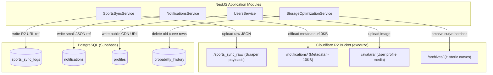

# ExoDuZe — Cloudflare R2 Storage Integration & Database Optimization Guide

This documentation details the architecture, code implementations, environment configurations, and database optimization strategies applied to keep the ExoDuZe backend and database lightweight, high-performance, and fully compliant with the resource constraints of Supabase Free Tier (500MB DB Limit).

---

## 🏗️ Architecture Overview

To prevent write-locks, replication lag, and rapid disk consumption in PostgreSQL, ExoDuZe offloads all large structured payloads, binary media, and cold historical logs to Cloudflare R2 (S3-compatible API). 

### Data Flow Architecture



---

## ⚙️ Environment Variables

### Backend Configuration (`api/.env` & `api/.env.production`)
Add the following credentials to your environment configuration files. When these keys are present, the application automatically activates R2 mode; if absent, it falls back gracefully to Supabase Storage and inline DB logging.

```env
# ============================================================================
# Cloudflare R2 Storage Configuration (S3-compatible API)
# ============================================================================
# Cloudflare Account ID (Found on your CF Dashboard sidebar)
CLOUDFLARE_R2_ACCOUNT_ID=42611b51e1dafd707102798e46695b66

# S3-compatible API Token Credentials (R2 -> Manage R2 API Tokens)
CLOUDFLARE_R2_ACCESS_KEY_ID=a17e4511331df5a52be6411c372cc05b
CLOUDFLARE_R2_SECRET_ACCESS_KEY=53bba57270adfa871d519c5fa662a68c391b99895867dc45e572e200eb1b7527

# Public CDN URL for serving public media (e.g. avatars, banners)
# Format: https://pub-xxxxxx.r2.dev or a custom domain like https://media.exoduze.com
CLOUDFLARE_R2_PUBLIC_URL=https://pub-ganti-dengan-hash-r2-anda.r2.dev

# Bucket Name Config (Consolidated single bucket setup)
CLOUDFLARE_R2_BUCKET_ARCHIVES=exoduze
CLOUDFLARE_R2_BUCKET_MEDIA=exoduze
CLOUDFLARE_R2_BUCKET_ETL_RAW=exoduze
```

### Frontend Configuration (`app/.env.local` & `app/.env.production`)
```env
NEXT_PUBLIC_CLOUDFLARE_R2_PUBLIC_URL=https://pub-ganti-dengan-hash-r2-anda.r2.dev
```

---

## 🛠️ Code Implementations & Optimizations

### 1. The Global R2 Service (`src/database/r2.service.ts`)
This service acts as the wrapper for the S3 Client, exposing high-level methods for object storage management:
* **`uploadObject(bucket, key, body, contentType)`**: Uploads a buffer or string to R2.
* **`getObject(bucket, key)`**: Retrieves an object as a string or readable buffer.
* **`deleteObject(bucket, key)`**: Deletes an object.
* **`getPresignedUploadUrl(...)`**: Generates a pre-signed URL allowing the frontend client to upload media directly to R2, bypassing backend resource usage.
* **`isActive()`**: Evaluates whether the application is configured to run Cloudflare R2.

### 2. Scraper Offloading (`src/modules/sports/sports-sync.service.ts`)
Scraper operations retrieve high-volume, repetitive JSON files from sports APIs. Instead of inserting large text blobs into DB tables:
* Payloads are stringified and written to `sports_sync_raw/${yearMonth}/${id}.json`.
* PostgreSQL logs the metadata execution summary and the lightweight reference URL (`r2_raw_payload_url`).
* Scraped modules optimized: `syncAllLeagues`, `syncUpcomingEvents`, `syncLiveScores`, `syncTeamsByLeague`, `syncOdds`, and `syncFromAPISports`.

### 3. Notification Payload Clamping (`src/modules/notifications/notifications.service.ts`)
System alerts and predictions can carry extensive JSON metadata:
* If a notification's metadata payload exceeds **10KB**, it is intercepted before PostgreSQL database write.
* The backend saves the raw metadata to `notifications/${userId}/${Date.now()}_metadata.json` on Cloudflare R2.
* The database record is written with a placeholder: `{ r2_archived: true, r2_url: "..." }`.

### 4. User Profile Assets (`src/modules/users/users.service.ts`)
* Profile avatar images bypass the database transaction completely.
* Images are uploaded directly to `avatars/${userId}/${Date.now()}.${fileExt}` inside the R2 media directory.
* The database profile's `avatar_url` is updated with the public Cloudflare CDN URL.

### 5. Curves & Logs Downsampling (`src/modules/markets/storage-optimization.service.ts`)
* High-frequency realtime prediction curves are compressed and archived to `archives/` prefix inside the `exoduze` bucket.
* Historic raw database rows are purged to reclaim DB space, maintaining database lightweight status.

---

## 🔒 Security & Best Practices

1. **Least Privilege API Tokens**: 
   When generating the Cloudflare R2 API token, select **"Object Read & Write"** scoped strictly to the `exoduze` bucket rather than using full administrative privileges.
2. **Access Control Routing**:
   * Public assets (e.g. `avatars/`) are served through the public R2 domain (`CLOUDFLARE_R2_PUBLIC_URL`).
   * Private logs (e.g. `archives/`, `sports_sync_raw/`) should have restricted public HTTP access. You can configure a **Cloudflare WAF (Web Application Firewall) rule** on the R2 domain to block incoming HTTP requests targeting paths starting with `/archives` or `/sports_sync_raw`.
3. **CORS Configuration**:
   If the frontend needs direct uploads/downloads to R2, apply a CORS policy to your R2 bucket. In the Cloudflare Dashboard, go to **R2 -> exoduze -> Settings -> CORS Policy** and paste:
   ```json
   [
     {
       "AllowedOrigins": ["https://exoduze.com", "http://localhost:3000", "http://localhost:5173"],
       "AllowedMethods": ["GET", "PUT", "POST", "DELETE", "HEAD"],
       "AllowedHeaders": ["*"],
       "ExposeHeaders": ["ETag"],
       "MaxAgeSeconds": 3000
     }
   ]
   ```
